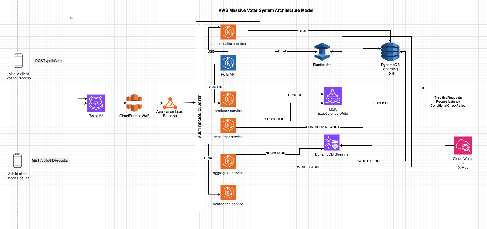
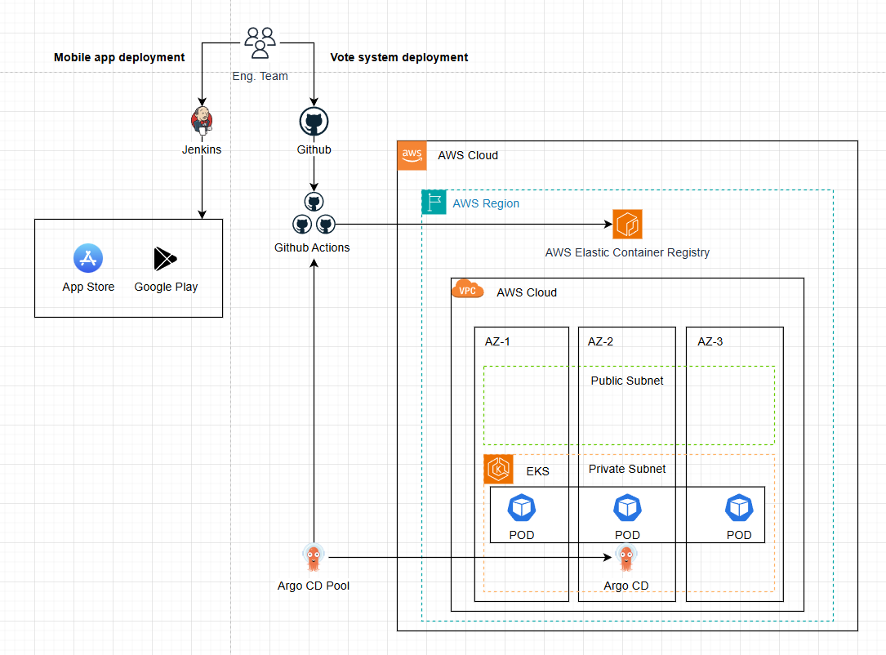
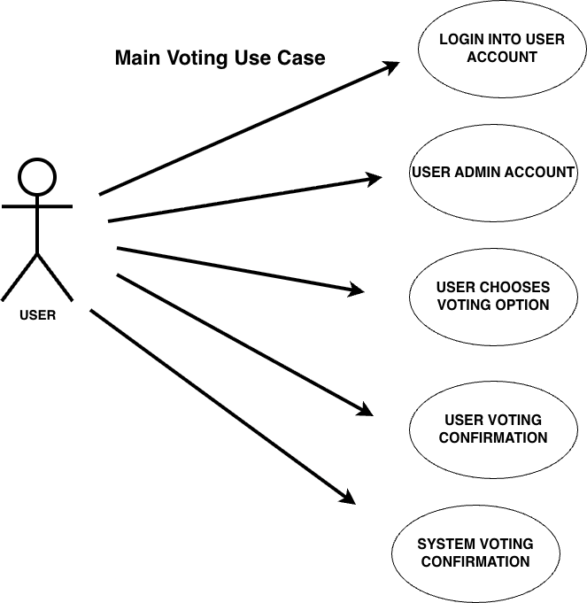
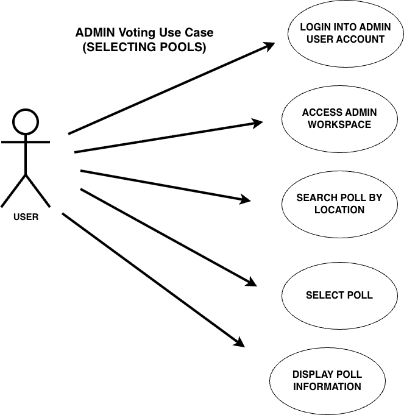
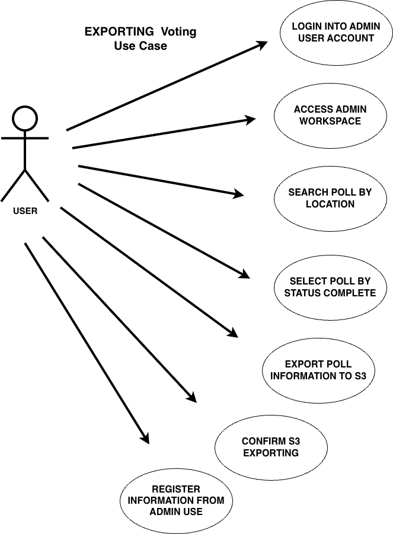
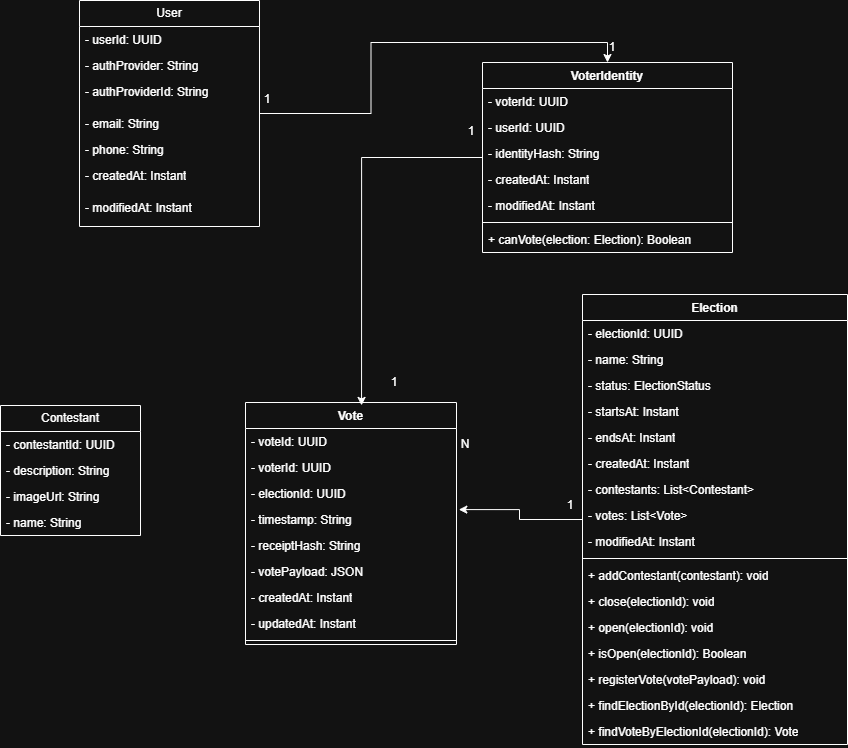

# 🧬 ARCHITECTURE KATA

## 🏛️ Structure

### 1. 🎯 Problem Statement and Context

Build a voting system for a huge tv show or event where 300 Million people might use it. Voting system cannot crash, lose votes, real time results, consistent

1. Realtime voting
2. 250.000 request per second
3. Secure against bots, hackers
4. Availability, Realibility, Scalability
5. Request one vote per person
6. Realtime results

- Restrictions
  - Serverless
  - MongoDB
  - On-premise infrastructure
  - Google Cloud & Microsoft Azure
  - OpenShift
  - Mainframes
  - Monolithic architectures

### 2. 🎯 Goals

- **Handle the Traffic:** the system must be strong enough to take 250k hits per second without breaking.
- **Save Every Vote:** When someone votes, we make sure it is saved safely before we tell them success.
- **Stop Cheaters:** We need security guards to block bots before they get in.
- **Real-time speed:** We need to send the vote count to everyone's phone instantly, like a live scoreboard.
- **Stay Online:** Even if part of the system breaks, the rest must keep working so people can still vote.
- **No Double voting:** We need to make sure nobody votes twice.

### 3. 🎯 Non-Goals

- **No monolith:** We won't build one giant block of software. We will break it into small pieces so it's easier to manage.
- **No mainframes:** We wont use mainframe computers or keep servers in our own office. We will use Cloud (AWS).
- **No Heavy Business Logic:** The app won't calculate totals or validate global vote limits; it remains a "thin client" focused on UI and local input validation.
- **No Local Truth:** Local storage (Hive/SharedPrefs) will not be the source of truth for a "successful vote"—only the server's signed acknowledgment counts.
- **No Custom Cryptography:** We won’t build our own encryption algorithms; we will strictly use platform-standard Secure Enclave (iOS) and Keystore (Android).

### 📐 4. Principles

1. **Security:** Security is non-negotiable; all components must have security controls in place.
2. **Event-Driven Architecture:** Use asynchronous ingestion via a message broker (kafka/sqs) to decouple high-velocity writes from processing.
3. **Optimistic UI Updates:** Provide the user with immediate visual confirmation of their vote while the actual sync happens asynchronously in the background.
4. **Reactive State Management:** Use BLoC or Signals to ensure the UI reacts instantly to backend streams without unnecessary full-screen rebuilds.
5. **Hardware-Backed Security:** Leverage Native Channels to access biometric hardware, ensuring the "one-person-one-vote" rule is tied to the physical device.
6. **Graceful Degradation:** If the network is congested, the app should automatically disable heavy animations and simplify the UI to prioritize the voting action.
7. **Observability** Fast feedbacks, detect, diagnose, and fix problems faster

### 🏗️ 5. Overall Diagrams

🗂️ 5.1 Overall architecture



🗂️ 5.2 Deployment



🗂️ 5.3 Use Cases







### 🧭 6. Trade-offs

```
1. One mobile code base - Mobile and web applications should be developed in Flutter to handle Web, IOS and Android versions.
2. Backend application should be built using microservices separated by schema/domains instead of serveless approach.
3. Cache - Use AWS Elastic cache instead of Redis
```

Tradeoffs:

```
1. Flutter vs Native
2. Route53 vs CloudFlare
3. CloudFront vs Akamai
4. AWS ECS on Fargate vs AWS EKS on Fargate
5. AWS RDS PostgreSQL vs AWS DynamoDB
6. AWS MSK (KAFKA) vs AWS SQS
7. Redis (Self-Hosted) vs AWS Elastic Cache
8. Auth0 vs Ory Hydra+Kratos
9. SQL vs NoSql
10. X-Ray vs Jaeger

```

## Flutter vs Native

### Flutter

#### PROS (+)

- **One Codebase:** A single codebase targets iOS and Android, reducing maintenance effort and ensuring feature parity.
- **Near‑Native Performance:** Compiles to ARM/machine code, enabling high performance close to native apps.
- **Consistent UI:** Uses the Skia/Impeller rendering engines to deliver pixel‑perfect, uniform UI across devices and OS versions.
- **Security Access:** Supports integration with platform-level security features like Secure Enclave (iOS) and Keystore (Android).
- **Realtime Ready:** Strong support for WebSockets, Streams, and gRPC, ideal for realtime or data-driven apps.

#### CONS (-)

- **Engine Overhead:** App binaries are generally larger because of the bundled Flutter engine.
- **Native Integration:** Advanced or highly platform-specific functionalities may require Method Channels using Swift/Kotlin.
- **Ecosystem Limitations:** Certain niche or OS‑specific libraries may be less mature than their native equivalents.

---

### Native

#### PROS (+)

- **Maximum Performance:** Direct access to the OS and hardware results in the best possible execution speed and responsiveness.
- **Deep Platform Integration:** Full support for advanced APIs (ARKit, Metal, Jetpack, etc.) with no abstraction layer.
- **Smallest Binary Footprint:** No embedded engine leads to smaller application sizes.
- **OS‑Aligned UI/UX:** User interfaces automatically follow platform guidelines, animations, and accessibility standards.

#### CONS (-)

- **Two Codebases:** iOS and Android require separate implementations, increasing maintenance costs and time to market.
- **Slower Feature Parity:** Releases may diverge if one platform receives updates sooner than the other.
- **Higher Development Cost:** Requires specialized skills in both ecosystems (Swift and Kotlin).

---

## Route53 vs CloudFlare

### Route 53

#### PROS (+)

- **Latency-based routing:** Using healthcheck precisely select the best region in AWS with automatic failover support.
- **Disaster Recovering:** Prevent DNS failures with global resolution it can quickly relocate to a different region in AWS when required.

#### CONS (-)

- **Vendor Lock-in:** When used with integration features like Latency-based routing is AWS-centric.
- **Multi-Cloud:** Except when used as purely DNS solution.

### CloudFare

#### PROS (+)

- **World Top Ranking:** Fastest Global DNS resolution.
- **DNSSEC and DDOS detection:** preventing man-in-the-middle filtering dns, prevent attacks absorbs massive traffic spikes as a shield.
- **Better for Multi-cloud:** Better choice when requirement needs multi-cloud solution, less dependency of proprietary protocols.

#### CONS (-)

- **Orange Cloud:** advanced features requires subscription on cloudflare infraestructure.
- **Routing and healthcheck:** Less routing (geolocation, latency) rules and less flexible when compared with Route 53 for AWS integration.

---

## CloudFront vs Akamai

### CloudFront

#### PROS (+)

- **High Availability:** Globally distributed edge network, automatic failover to secondary origins, no infrastructure to manage
- **Security:** WAF integration geolocation restriction, DDos Protection via AWS Shield.

#### CONS (-)

- **Vendor Lock-in:** Strong AWS coupling, IAM integration makes migration even harder.
- **Pricing Complexity:** price varies between regions, extra features have an additional cost, the first 1000 cache misses are free.

### Akamai

#### PROS (+)

- **Global Reach:** Extremely mature, global presence more than 20 years of edge infraestructure evolution.
- **Multi-Cloud:** Works independently of any cloud, easier in hybrid or multi-cloud strategies

#### CONS (-)

- **Higher Cost:** Overkill for small and middle systems best suited for large enterprises with negotiation leverage.

---

## AWS ECS on Fargate vs AWS EKS on Fargate

### AWS EKS on Fargate

#### PROS (+)

- **Management:** No management, cluster simplicity with Fargate profiles.
- **Isolation:** No cluster nodes, each pod runs in a micro-VM with Firecracker.
- **Billing:** No capacity plan, pay per use, CPU and memory usage only.
- **Scaling:** Auto scaling only in pods, more efficient and faster than node election.

#### CONS (-)

- **Customization:** No DaemonSets, there are no EC2 nodes, and also a limited ephemeral disk (~20 GiB).
- **Observability:** Agents must be sidecars on pods (instead of cluster-wide DaemonSets).
- **Cost:** It can be more expensive than EC2 if you have heavy batch jobs or high compute throughput.

---

### AWS ECS on Fargate

#### PROS (+)

- **Zero infrastructure management:** AWS handles provisioning, scaling, patching.
- **Isolation:** Strong security boundary per task (ideal for multi-tenancy).
- **Pay-as-you-go:** Billing is per vCPU and GiB-hour, no wasted capacity.
- **Auto-scaling:** Tasks scale without cluster capacity planning.

#### CONS (-)

- **Feature limits:** No privileged containers, host networking, GPUs.
- **Cost:** More expensive for sustained or heavy workloads than EC2.
- **Quotas:** Fargate launch throttles and ephemeral storage (~20 GiB default).
- **Observability:** No DaemonSets — logging/monitoring agents must run as sidecars (extra cost overhead).

## Database

### AWS RDS PostgreSQL

#### PROS (+)

- **Scalability:** Scales vertically and horizontally via Aurora read replicas.
- **Performance:** Strong OLTP performance with indexes and joins.
- **Latency:** Low-latency reads in multiple Regions.

#### CONS (-)

- **Limitation:** Must use RDS Proxy or pooling for apps with millions of users.
- **Operation:** Still need to think about version upgrades, storage, scaling thresholds, and failover planning.
- **Multi-Region writes:** Global database only supports fast cross-Region reads; writes go to one Region.

---

### AWS DynamoDB

#### PROS (+)

- **Performance:** Single-digit millisecond latency at any scale(SSD-backed).
- **Scalability:** Horizontal Scaling included by design, Automatic partitioning, trillions of items, 10M+ req/sec.
- **Availability:** Built-in multi-AZ replication(multi-region, active-active).

#### CONS (-)

- **Performance:** No Relational queries (no joins, no OR conditions).
- **Flexibility:** Schema Less, requires careful (Partition Key/Sort Key) upfront data modeling, Query patterns must be known early.
- **Cost:** Expensive if: high read/write rates, inefficient partition keys, large items >400kb.

## AWS MSK (KAFKA) vs AWS SQS

### AWS MSK (KAFKA)

#### PROS (+)

- **Debugging:** Event streaming with replay/rewind.
- **Scalability:** High throughput.
- **Consistency:** Strict ordering per partition.
- **Integration:** Rich ecosystem (Kafka Streams, Flink, Connect).

#### CONS (-)

- **Overhead:** Operational complexity.
- **Cost:** Costly at low/variable volume.

---

### AWS SQS

#### PROS (+)

- **Simplicity:** Fully managed, zero ops.
- **Cost:** Pay-per-request pricing.
- **Reliability:** DLQs and retries built-in.
- **Security:** IAM integration + per-queue isolation.
- **Automation:** Tight AWS integration (Lambda, Step Functions).

#### CONS (-)

- **Duplication:** At-least-once delivery only.

## Redis (Self-Hosted) vs AWS Elastic Cache

### Redis (Self-Hosted)

#### PROS (+)

- **Performance:** Redis offers multiple methods for caching data, which can significantly reduce data access latency and increase throughput.

#### CONS (-)

- **Cost:** Redis clustering solutions needs to be done in-house and requires a significant amount of effort.

---

### AWS Elastic Cache

#### PROS (+)

- **Setup and Maintenance:** ElastiCache is a fully managed AWS service for Redis, not necessary to deal with ec2 instances and configs to install Redis.

#### CONS (-)

- **Limitations:** ElastiCache runs only within the Amazon Web Services ecosystem, you may be concerned about vendor lock-in.

## Tradeoffs Auth0 vs Ory Hydra+Kratos

### AUTH0

#### PROS (+)

- **Setup:** Fully managed SaaS, quick setup with minimal configuration.
- **Features:** Comprehensive auth solution (login UI, MFA, social/enterprise SSO, user management, all included).
- **Integrations:** Extensive pre-built integrations (100+ social/enterprise providers, SDKs for all major platforms).
- **Developer Experience:** Rich documentation, pre-built UI components (Universal Login), extensive SDK ecosystem.
- **Time-to-Market:** Near-instant deployment, no infrastructure management.

#### CONS (-)

- **Cost:** Expensive at scale (pricing based on MAUs, can reach $10K+/month for high volume).
- **Vendor Lock-in:** Proprietary APIs and data models make migration challenging.
- **Customization:** Limited control over core flows, infrastructure, and data storage location.
- **Performance & control:** Latency and behavior tied to Auth0 regions and infrastructure; limited tuning.
- **Data Sovereignty:** User data stored in Auth0's infrastructure (compliance risk in some regions).
- **Flexibility:** Difficult to implement non-standard OAuth flows or custom business logic.

---

### ORY (HYDRA + KRATOS)

#### PROS (+)

- **Cost:** Open source (Apache 2.0), self-hosted = free for unlimited users. Ory Network offers managed option.
- **Control:** Full control over infrastructure, data residency, deployment topology.
- **Feature Completeness:** Hydra (OAuth2/OIDC) + Kratos (identity/user management, registration, login, recovery, MFA, profile management).
- **Customization:** Complete flexibility in UI/UX design, business logic, custom auth flows, and user journey.
- **Performance:** Deploy in your VPC/regions for optimal latency and data locality.
- **Scalability:** Battle-tested at scale (millions of users), horizontal scaling, stateless architecture.
- **Modularity:** Use both together or separately; integrate with existing systems; swap components as needed.

#### CONS (-)

- **Setup Complexity:** Requires configuring two services (Hydra + Kratos) and building/customizing UIs using pre-built components.
- **Operations:** Self-hosting means managing infrastructure, databases, monitoring, updates, security patches for both services.
- **Integration Work:** Social logins and enterprise SSO require configuration and custom integration code.
- **Support:** Community support only (unless paying for Ory Network or enterprise support).
- **Time-to-Market:** Longer initial setup and customization compared to turnkey SaaS solutions.

## Tradeoffs SQL vs NoSql

### SQL

#### PROS (+)

- **Consistency:** Strong ACID guarantees, perfect for enforcing rules like `UNIQUE (election_id, voter_id)`.
- **Integrity:** Native constraints (FK, UNIQUE, CHECK) prevent invalid states by design.
- **Transactions:** Multi-row and multi-table transactions ensure atomic operations.
- **Joins:** Efficient relational queries across users, voter identities, elections, and votes.
- **Maturity:** Tooling, monitoring, migrations, and operational stability are excellent.
- **Auditability:** Ideal for systems where every write must be traceable and deterministic.

#### CONS (-)

- **Scalability:** Horizontal sharding is more complex than in many NoSQL databases.
- **Operational Overhead:** Large relational schemas require careful indexing and tuning.
- **Flexibility:** Schema changes (migrations) are more rigid and may require downtime windows.
- **Cost:** At massive scale, distributed SQL clusters (e.g., Cockroach, Yugabyte) can be expensive.
- **Write Throughput:** Not optimized for extremely high write rates per second (e.g., billions/hour) without sharding.

---

### NoSql

#### PROS (+)

- **Scalability:** Designed for effortless horizontal scaling and very high write throughput.
- **Availability:** Prioritizes uptime and partition tolerance (AP in CAP theorem).
- **Flexibility:** Schema-less models allow rapid iteration without migrations.
- **Cost:** Commodity hardware, auto-sharding, and simple replication can reduce infrastructure cost.
- **Distribution:** Multi-region replication and low-latency access are usually built-in.

#### CONS (-)

- **Native Consistency:** Lacks strong ACID semantics by default; eventual consistency is common.
- **Uniqueness:** No native support for constraints like `UNIQUE (election_id, voter_id)` across shards.
- **Transactions:** Limited or nonexistent multi-document or multi-collection transactions.
- **Integrity:** Application must enforce invariants — error-prone and unsafe for voting systems.
- **Querying:** Complex relational queries and joins are not supported or require manual composition.
- **Auditability:** Harder to guarantee deterministic, tamper-proof, append-only records.

## Tradeoffs X-Ray vs Jaeger

### X-Ray

#### PROS (+)

- **AWS integration:** Seamlessly integrates with AWS Lambda, Amazon EC2, Amazon ECS, and Amazon API Gateway.
- **Simple setup:** Minimal configuration when running inside AWS.
- **Fully managed:** No need to maintain tracing infrastructure.
- **Security:** Works with IAM roles and AWS security policies.

#### CONS (-)

- **Vendor lock-in:** Strong dependency on the AWS ecosystem.
- **Limited flexibility:** Less customizable compared to open-source solutions.
- **Cost:** High trace volume can become expensive.
- **Closed ecosystem:** Feature evolution depends on AWS roadmap.

---

### Jaeger

#### PROS (+)

- **Open source:** No vendor lock-in and strong community support.
- **Multi-cloud:** Runs anywhere (Kubernetes, VMs, bare metal).
- **Integration:** Native compatibility with OpenTelemetry.
- **Flexibility:** No vendor lock-in

#### CONS (-)

- **Complexity:** Requires managing storage, scaling, and retention.
- **Maintenance:** Upgrades and tuning are your responsibility.
- **Indirect cost:** Infrastructure and operational overhead.

### 🌏 6. For each key major component

| Component              | Technology Choice & Rationale                                                                                                                                                                 |
| :--------------------- | :-------------------------------------------------------------------------------------------------------------------------------------------------------------------------------------------- |
| **Frontend Framework** | **Flutter:** Selected over Native to maintain a **single codebase** for iOS, Android, and Web while achieving near-native performance and hardware access (biometrics).                       |
| **CDN**                | **Amazon CloudFront:** Preferred over Akamai due to its native integration with **AWS Shield** for DDoS protection and simplified IAM security management within the AWS ecosystem.           |
| **Orchestration**      | **AWS EKS on Fargate:** Selected over ECS to leverage the standard **Kubernetes** ecosystem while using Fargate to eliminate node management overhead and ensure pod-level isolation.         |
| **Database**           | **Amazon DynamoDB:** Chosen over RDS PostgreSQL for the voting ledger because it offers **single-digit millisecond latency** and unlimited horizontal scalability required for 250k req/s.    |
| **Messaging**          | **AWS MSK (Kafka):** Selected over SQS because strict **event ordering** and stream replay capabilities are critical for auditability and data consistency in the voting process.             |
| **Caching**            | **Amazon ElastiCache:** Chosen over self-hosted Redis to offload operational maintenance ("fully managed") while providing high-throughput in-memory caching for real-time results.           |
| **Identity**           | **Ory (Hydra + Kratos):** Selected over Auth0 to avoid prohibitive costs at 300M users and to ensure full **data sovereignty** and control over the authentication infrastructure.            |
| **Persistence Model**  | **Polyglot (NoSQL + SQL):** Utilizes **NoSQL (DynamoDB)** for massive write throughput on votes, while retaining **SQL (PostgreSQL)** for strict consistency in user identity management.     |
| **Observability**      | **AWS X-Ray:** Preferred over Jaeger for its **seamless integration** with AWS Lambda/EKS and zero-maintenance managed infrastructure. Grafana, Loki and Prometheus are using in the services |

# Endpoints:

### <span style='color:#3BC143 ;font-weight: bold;'>LOGIN INTO USER ACCOUNT</span>

#### <span style='color:#3BC143 ;font-weight: bold;'>Login flow calls</span>

method: <span style='color:#FFBE33;font-weight: bold;'>GET</span>
path: <span style='color:#FFBE33;font-weight: bold;'>/self-service/login/api</span>

- response

```json
{
  "id": "fc1e197b-52c3-49c2-a4e7-db4b8122ecc7"
}
```

#### <span style='color:#3BC143 ;font-weight: bold;'>Submit login credentials</span>

method: <span style='color:#FFBE33;font-weight: bold;'>POST</span>
path: <span style='color:#FFBE33;font-weight: bold;'>/self-service/login?flow=FLOW_ID</span>

- headers

```json
{
  "Content-Type": "application/json"
}
```

- request

```json
{
  "method": "password",
  "identifier": "voter@example.com",
  "password": "StrADSgPass123!"
}
```

- response

```json
{
  "session_token": "ory_st_5BLHJrBecmHai5eHKsJLd0FhcskLDmi4"
}
```

#### <span style='color:#3BC143 ;font-weight: bold;'>Exchange code for token</span>

method: <span style='color:#FFBE33;font-weight: bold;'>POST</span>
path: <span style='color:#FFBE33;font-weight: bold;'>/oauth2/token</span>

AUTH_CODE="xyz789"

- headers

```json
{
  "Content-Type": "application/x-www-form-urlencoded",
  ""
}
```

- request

  ```urlencoded
  grant_type=authorization_code
  client_id=voter-android
  code=AUTH_CODE
  redirect_uri=com.myapp://oauth2redirect
  ```

#### <span style='color:#3BC143 ;font-weight: bold;'>JWKS endpoint is what Vote API uses to validate access tokens locally</span>

method: <span style='color:#FFBE33;font-weight: bold;'>GET</span>
path: <span style='color:#FFBE33;font-weight: bold;'>/.well-known/jwks.json</span>

- headers

```json
{
  "Accept": "application/json"
}
```

- response

```json
{
  "keys": [
    {
      "use": "sig",
      "kty": "RSA",
      "kid": "97296440-a757-46b9-81c0-9b1f9f11f3ec",
      "alg": "RS256",
      "n": "76_44z11arK4utTVIjF2xsQMXV3EHu-ln7T1A7xitn0O21oj1_vZHZuzfNvebOPuXcvF5TYrvR5wVp4jzK49rK7A2a6pNs0wIqt20Z2D55P7f6JaVZnO1ZTgBAT-t4yxc33h4qdwMbVfvTHMjsJ4S2ozSG7yQx4DjgI2bNZ_dH8TS3grKNRcaQTKl4UcSWSCW6ok2Ij_yWKLhjfA1Hc4iEq7WK3PrEhtc3tmQHkuKqZNvtwg_QnnexetEi-rDu1igw6LLjFqxEIT2Ryf4-5fvFSsS8w0cE1aGMUfEbg8_9GzFjav-i7UtjOM1GiwIWyIAr4VV5zxKfxlugoEA56D4dNp-YEOQUYK921uGL03OiHhAcW-MB7QWAIwwt1x34ycE_wOnwzz6D3u8GM0GtfFzzOoLu6cKUroZMTh834yIdLM6ddfb9bppbVH1UeuTDoLWWpKxvKKRrNJDSh_ZlOHaPo0G5nMbnXVgPY2F7e-f0zSLjHPSpjiznYihiztbmPdViBBWGvLlc2ipr4jGSOvTG6-6HHazsfSX3SUFFgvOSzEphNgi50ODJ1HSuV0WPElPhjL3JZxyHejo1scXSJGk64OvPAT8dCbRXEbfXZpvTkxGpegeOPqVTcuBxyd76XiGAmS-rVbfoFEdg19uLiDw9n1_0i-m9OfiQmqZh9ZRrc",
      "e": "AQAB"
    }
  ]
}
```

### <span style='color:#3BC143 ;font-weight: bold;'>USER CHOOSES VOTING OPTIONS</span>

#### <span style='color:#3BC143 ;font-weight: bold;'>List open elections</span>

method: <span style='color:#FFBE33;font-weight: bold;'>GET</span>
path: <span style='color:#FFBE33;font-weight: bold;'>v1/elections?status=OPEN</span>

- Endpoint to get the elections available.

1. Authorization header with valid Bearer token is required.
2. Fields: name, starts_at, ends_at, and at least one contestant are required.
3. Response code success must be 201 Created
4. Response code failure for invalid fields must be 400 Bad Request
5. Response code failure for unauthorized must be 401 Unauthorized
6. Response code failure for forbidden operation must be 403 Forbidden.
   - headers

   ```json
   {
     "Authorization": "Bearer access_token"
   }
   ```

   - response

   ```json
   {
     "elections": [
       {
         "election_id": "uuid",
         "name": "Election Name",
         "status": "OPEN",
         "starts_at": "2026-02-01T10:10:00Z",
         "ends_at": "2026-04-01T10:10:00Z"
       }
     ]
   }
   ```

### <span style='color:#3BC143 ;font-weight: bold;'>Get voting options</span>

method: <span style='color:#FFBE33;font-weight: bold;'>GET</span>
path: <span style='color:#FFBE33;font-weight: bold;'>v1/election/{election_id}</span>

- Endpoint to get the Contestants of the elections

1. Authorization header with valid Bearer token is required.
2. Response code success must be 200 Ok
3. Response code failure for invalid fields must be 400 Bad Request
4. Response code failure for unauthorized must be 401 Unauthorized
5. Response code failure for forbidden operation must be 403 Forbidden.
   - headers

   ```json
   {
     "Authorization": "Bearer access_token"
   }
   ```

   - response

   ```json
   {
     "election_id": "uuid",
     "name": "Election Name",
     "vote_payload": {
       "contestants": [
         {
           "name": "Contestant 1 name",
           "description": "Contestant 1 Description",
           "image": "Contestant 1 Image"
         },
         {
           "name": "Contestant 2 name",
           "description": "Contestant 2 Description",
           "image": "Contestant 2 Image"
         }
       ]
     }
   }
   ```

### <span style='color:#3BC143 ;font-weight: bold;'>USER CHOOSES VOTING OPTIONS</span>

#### <span style='color:#3BC143 ;font-weight: bold;'>Submit vote</span>

method: <span style='color:#FFBE33;font-weight: bold;'>GET</span>
path: <span style='color:#FFBE33;font-weight: bold;'>v1/election/submit</span>

- Endpoint to get submit the vote

1. Authorization header with valid Bearer token is required.
2. Response code success must be 200 Ok
3. Response code failure for invalid fields must be 400 Bad Request
4. Response code failure for unauthorized must be 401 Unauthorized
5. Response code failure for forbidden operation must be 403 Forbidden.
   - headers

   ```json
   {
     "Authorization": "Bearer access_token"
   }
   ```

   - request

   ```json
   {
     "election_id": "uuid",
     "voter_id": "uuid",
     "vote_payload": {
       "contestant_id": "1234"
     }
   ```

   -response

   ```json
   {
     "receipt_hash": "e3b0c44298fc1c149afbf4c8996fb92427ae41e4649b934ca495991b7852b855"
   }
   ```

### <span style='color:#3BC143 ;font-weight: bold;'>USER VOTING CONFIRMATION</span>

#### <span style='color:#3BC143 ;font-weight: bold;'>Get voting information</span>

method: <span style='color:#FFBE33;font-weight: bold;'>GET</span>
path: <span style='color:#FFBE33;font-weight: bold;'>v1/votes/{vote_id}/{voter_id}</span>

- Endpoint to get Information about the vote

1. Authorization header with valid Bearer token is required.
2. Response code success must be 200 Ok
3. Response code failure for invalid fields must be 400 Bad Request
4. Response code failure for unauthorized must be 401 Unauthorized
5. Response code failure for forbidden operation must be 403 Forbidden.
   - headers

   ```json
   {
     "Authorization": "Bearer access_token"
   }
   ```

   -response

   ```json
   {
     "status": "vote_confirmed",
     "vote_payload": {
       "contestant_id": "1234",
       "contestant_name": "Contestant Name"
     },
     "timestamp": "2026-02-01T10:10:00Z"
   }
   ```

### <span style='color:#3BC143 ;font-weight: bold;'>SYSTEM VOTING CONFIRMATION</span>

#### <span style='color:#3BC143 ;font-weight: bold;'>Get system voting confirm</span>

method: <span style='color:#FFBE33;font-weight: bold;'>GET</span>
path: <span style='color:#FFBE33;font-weight: bold;'>v1/votes/{vote_id}</span>

- Endpoint to get Information about the vote

1. Authorization header with valid Bearer token is required.
2. Response code success must be 202 Accepted
3. Response code failure for invalid fields must be 400 Bad Request
4. Response code failure for unauthorized must be 401 Unauthorized
5. Response code failure for forbidden operation must be 403 Forbidden.
   - headers

   ```json
   {
     "Authorization": "Bearer access_token"
   }
   ```

   -response

   ```json
   {
     "status": "vote_successfully_recorded",
     "vote_id": "abc123",
     "timestamp": "2026-02-01T10:00:00Z"
   }
   ```

### <span style='color:#3BC143 ;font-weight: bold;'>ACCESS ADMIN WORKSPACE</span>

method: <span style='color:#FFBE33;font-weight: bold;'>GET</span>
path: <span style='color:#FFBE33;font-weight: bold;'>/v1/admin/elections?status=draft?status=open?name=ElectionName?starts_after=2026-01-01</span>

1. Authorization header with valid Bearer token is required.
2. Response code success must be 200 Ok
3. Response code failure for invalid fields must be 400 Bad Request
4. Response code failure for unauthorized must be 401 Unauthorized
5. Response code failure for forbidden operation must be 403 Forbidden.

- headers

```json
{
  "Authorization": "Bearer access_token"
}
```

-response

```json
[
  {
    "election_id": "uuid",
    "name": "ElectionName",
    "status": "OPEN",
    "starts_at": "2026-02-01T00:00:00Z",
    "ends_at": "2026-04-01T20:00:00Z"
  }
]
```

### <span style='color:#3BC143 ;font-weight: bold;'>SEARCH POLL BY LOCATION</span>

method: <span style='color:#FFBE33;font-weight: bold;'>GET</span>
path: <span style='color:#FFBE33;font-weight: bold;'>/v1/admin/elections/poll/{country}</span>

1. Authorization header with valid Bearer token is required.
2. Response code success must be 200 Ok
3. Response code failure for invalid fields must be 400 Bad Request
4. Response code failure for unauthorized must be 401 Unauthorized
5. Response code failure for forbidden operation must be 403 Forbidden.

- headers

  ```json
  {
    "Authorization": "Bearer access_token"
  }
  ```

-response

```json
[
  {
    "election_id": "uuid",
    "name": "ElectionName",
    "status": "closed",
    "ends_at": "2026-02-01T10:00:00Z",
    "total_votes": 250000000
  }
]
```

### <span style='color:#3BC143 ;font-weight: bold;'>SELECT POLL INFORMATION</span>

method: <span style='color:#FFBE33;font-weight: bold;'>GET</span>
path: <span style='color:#FFBE33;font-weight: bold;'>/v1/admin/elections/poll/{election_id}</span>

1. Authorization header with valid Bearer token is required.
2. Response code success must be 200 Ok
3. Response code failure for invalid fields must be 400 Bad Request
4. Response code failure for unauthorized must be 401 Unauthorized
5. Response code failure for forbidden operation must be 403 Forbidden.

- headers

  ```json
  {
    "Authorization": "Bearer access_token"
  }
  ```

- response
  ```json
  {
    "election_id": "uuid",
    "name": "ElectionName",
    "status": "OPEN",
    "starts_at": "2026-02-01T00:00:00Z",
    "ends_at": "2026-04-01T20:00:00Z",
    "total_votes": 12500000
  }
  ```

### <span style='color:#3BC143 ;font-weight: bold;'>DISPLAY POLL INFORMATION</span>

method: <span style='color:#FFBE33;font-weight: bold;'>GET</span>
path: <span style='color:#FFBE33;font-weight: bold;'>/v1/admin/elections/poll/{election_id}/stats</span>

1. Authorization header with valid Bearer token is required.
2. Response code success must be 200 Ok
3. Response code failure for invalid fields must be 400 Bad Request
4. Response code failure for unauthorized must be 401 Unauthorized
5. Response code failure for forbidden operation must be 403 Forbidden.

- headers

```json
{
  "Authorization": "Bearer access_token"
}
```

- response
  ```json
  {
    "total_votes": 12500000,
    "votes_last_hour": 250000,
    "status": "OPEN",
    "participation_rate": 0.62
  }
  ```

### <span style='color:#3BC143 ;font-weight: bold;'>EXPORT POLL INFORMATION TO S3</span>

method: <span style='color:#FFBE33;font-weight: bold;'>POST</span>
path: <span style='color:#FFBE33;font-weight: bold;'>/v1/admin/elections/poll/{election_id}/exports</span>

1. Authorization header with valid Bearer token is required.
2. Response code success must be 200 Ok
3. Response code failure for invalid fields must be 400 Bad Request
4. Response code failure for unauthorized must be 401 Unauthorized
5. Response code failure for forbidden operation must be 403 Forbidden.

- headers

  ```json
  {
    "Authorization": "Bearer access_token"
  }
  ```

- request

  ```json
  {
    "format": "csv"
  }
  ```

- response
  ```json
  {
    "export_id": "uuid",
    "status": "processing",
    "requested_at": "2026-02-01T10:00:00Z"
  }
  ```

### <span style='color:#3BC143 ;font-weight: bold;'>CONFIRM S3 EXPORTING</span>

method: <span style='color:#FFBE33;font-weight: bold;'>POST</span>
path: <span style='color:#FFBE33;font-weight: bold;'>/v1/admin/exports/{export_id}</span>

1. Authorization header with valid Bearer token is required.
2. Response code success must be 200 Ok
3. Response code failure for invalid fields must be 400 Bad Request
4. Response code failure for unauthorized must be 401 Unauthorized
5. Response code failure for forbidden operation must be 403 Forbidden.

- headers

  ```json
  {
    "Authorization": "Bearer access_token"
  }
  ```

- response
  ```json
  {
    "export_id": "uuid",
    "status": "completed",
    "file_url": "https://bucket.s3.amazonaws.com/election-uuid.csv",
    "file_size_bytes": 9823749823,
    "completed_at": "2026-02-01T10:20:00Z"
  }
  ```

---

## 6.1 - Class Diagram



## 6.2 - Contract Documentation

- We must use OAuth 2.0 to access/refresh tokens
- We must use REST API
- We must use AWS Gateway

## 6.3 Persistence Model

### **users**

| Field          | Type    | NOT NULL | Default   | Description                                   |
| -------------- | ------- | -------- | --------- | --------------------------------------------- |
| userId         | UUID    | YES      | generated | Primary key                                   |
| authProvider   | String  | YES      | —         | Authentication provider (Google, Apple, etc.) |
| authProviderId | String  | YES      | —         | Unique ID from provider                       |
| email          | String  | NO       | —         | Optional contact email                        |
| phone          | String  | NO       | —         | Optional contact phone                        |
| createdAt      | Instant | YES      | now()     | Creation timestamp                            |
| modifiedAt     | Instant | NO       | —         | Last modification timestamp                   |

```json
{
  "User": {
    "userId": "UUID", // Primary key, NOT NULL
    "authProvider": "String", // NOT NULL, e.g. Google, Apple
    "authProviderId": "String", // NOT NULL, unique per provider
    "email": "String", // Optional
    "phone": "String", // Optional
    "createdAt": "Instant", // NOT NULL, default: now()
    "modifiedAt": "Instant" // Nullable, last update timestamp
  }
}
```

---

### **voter_identities**

```json
{
  "VoterIdentity": {
    "voterId": "UUID", // Primary key, NOT NULL
    "userId": "UUID", // NOT NULL, FK -> User(userId)
    "identityHash": "String", // NOT NULL, hashed real identity for deduplication
    "createdAt": "Instant", // NOT NULL, default: now()
    "modifiedAt": "Instant" // Nullable, last update timestamp
  }
}
```

---

### **elections**

```json
{
  "Election": {
    "electionId": "UUID", // Primary key, NOT NULL
    "name": "String", // NOT NULL, election display name
    "status": "ElectionStatus", // NOT NULL, values: draft | open | closed
    "startsAt": "Instant", // Nullable, voting start time
    "endsAt": "Instant", // Nullable, voting end time
    "createdAt": "Instant", // NOT NULL, default: now()
    "modifiedAt": "Instant" // Nullable, last update timestamp
  }
}
```

---

### **votes**

```json
{
  "Vote": {
    "voteId": "UUID", // Primary key, NOT NULL
    "electionId": "UUID", // NOT NULL, FK -> Election(electionId)
    "voterId": "UUID", // NOT NULL, FK -> VoterIdentity(voterId)
    "timestamp": "Instant", // NOT NULL, vote submission time
    "receiptHash": "String", // NOT NULL, unique vote receipt
    "votePayload": "JSON", // NOT NULL, encrypted/anonymized ballot
    "createdAt": "Instant", // NOT NULL, default: now()
    "updatedAt": "Instant" // Nullable, last update timestamp
  }
}
```

---

#### 6.4 - Algorithms/Data Structures : Specific algos that need to be used, along size with spesific data structures.

### 🖹 7. Migrations

IF Migrations are required describe the migrations strategy with proper diagrams, text and tradeoffs.

- N/A

### 🖹 8. Testing strategy

Explain the techniques, principles, types of tests and will be performaned, and spesific details how to mock data, stress test it, spesific chaos goals and assumptions.

- Manual testing - Involves manual inspection and testing of the software by a human tester.
- Automated testing - software tools to automate the testing process
- Unit testing - Tests individual units or components of the software to ensure they are functioning as intended.
- Integration testing - Tests the integration of different components of the software to ensure they work together as a system.
- Regression testing – Tests the software after changes or modifications have been made to ensure the changes have not introduced new defects.
- Performance testing - Tests the software to determine its performance characteristics such as speed, scalability, and stability.
- Security testing – Tests the software to identify vulnerabilities and ensure it meets security requirements.
- Usability testing – Tests the software to evaluate its user-friendliness and ease of use.

### Frontend Testing Strategy

- **Unit Testing:** Validates business logic and state managers (BLoCs/Providers) to ensure vote processing and local validation logic are mathematically sound.
- **Widget Testing:** Verifies individual UI components (buttons, input fields) in isolation to ensure they render correctly and respond to user interactions without a full app boot.
- **Integration Testing:** Executes end-to-end flows on physical devices to test the handshake between Flutter and Native modules (Biometrics/Secure Storage).
- **Security Testing:** Focuses on the OAuth2/PKCE flow and ensures that biometric data is never stored locally and that the "one-vote-per-user" lock cannot be bypassed.
- **Usability Testing:** Leverages Flutter’s Semantics and accessibility tools to ensure the voting interface is clear and usable for all users under the pressure of a live event.
- **Mocking Data:** We use Mockito or Mocktail to stub API responses, simulating "success," "conflict" (already voted), and "unauthorized" scenarios without hitting live servers.
- **Stress Testing:** We perform "UI Load Testing" by bombarding the app’s state management with high-frequency stream updates to verify the UI remains responsive and doesn't crash from over-rendering.
- **Chaos Goals:** Purposefully inject network latency (up to 2000ms) or 50% packet loss via proxy tools to test the app's retry logic and "Offline Mode" indicators.
- **Assumptions:** We assume users will have varying network quality; the frontend must prioritize an "Optimistic UI" (showing local success immediately) while the vote syncs in the background.

### 🖹 9. Observability strategy

- Zero Vote Loss Policy: Any discrepancy between received and persisted votes must trigger immediate alerts.
- Real-Time Monitoring: All critical voting metrics must be visible in near real-time.
- Full Request Traceability: Each vote must be traceable across services.
- Security-First Logging: Sensitive data (tokens, vote payloads, identity hashes) must never be logged.
- Proactive Alerting: Detect issues before users notice them.
- Dashboard design: Grafana provides real-time dashboards.
- Metrics dashboards should contain errors, alert identifying any service errors

Logging Strategy

- INFO: Successful vote submission, export creation, admin access.
- WARN: Duplicate vote attempt, rate limit exceeded.
- ERROR: Vote persistence failure, messaging failure, database timeout.

Alerting Strategy

- Alerts: Managed through Prometheus AlertManager and integrated with Slack and PagerDuty.
- Critical Alerts: Vote loss detected (immediate escalation), Error rate above threshold, DynamoDB write failure rate exceeds 1%
- Warning Alerts: High CPU or memory usage, cache hit ratio degradation, increased authentication failures.

### 🖹 10. Data Store Designs

1. PostgreSQL (Authentication and Identity)

- Exclusively handles identity management, Oauth2 tokens, and user profiles via ORY Hydra (OAuth2) and ORY Kratos (Identity).

2. Amazon DynamoDB (Voting Source of Truth)

- Stores the actual immutable votes and aggregated results.

3. Amazon ElasticCache

- Serves the real-time aggregated results.

### 🖹 11. Technology Stack

Describe your stack, what databases would be used, what servers, what kind of components, mobile/ui approach, general architecture components, frameworks and libs to be used or not be used and why.

- Frontend: Flutter
- Security: OAuth2 + OIDC (PKCE), Biometrics
- Language: Java 25
- Framework: Spring Boot 3
- Container: Docker
- Orchestration: EKS Kubernetes
- API: REST
- Auth: OAuth2 + JWT
- Databases: DynamoDB + PostgreSQL + ElasticCache
- Messaging: Kafka (AWS MSK)
- CI/CD: GitHub Actions + ArgoCD
- Monitoring: Prometheus + Grafana
- Logging: Loki
- Tracing: Xray

### 🖹 12. References

- Architecture Anti-Patterns: https://architecture-antipatterns.tech/
- EIP https://www.enterpriseintegrationpatterns.com/
- SOA Patterns https://patterns.arcitura.com/soa-patterns
- API Patterns https://microservice-api-patterns.org/
- Anti-Patterns https://sourcemaking.com/antipatterns/software-development-antipatterns
- Refactoring Patterns https://sourcemaking.com/refactoring/refactorings
- Database Refactoring Patterns https://databaserefactoring.com/
- Data Modelling Redis https://redis.com/blog/nosql-data-modeling/
- Cloud Patterns https://docs.aws.amazon.com/prescriptive-guidance/latest/cloud-design-patterns/introduction.html
- 12 Factors App https://12factor.net/
- Relational DB Patterns https://www.geeksforgeeks.org/design-patterns-for-relational-databases/
- Rendering Patterns https://www.patterns.dev/vanilla/rendering-patterns/
- REST API Design https://blog.stoplight.io/api-design-patterns-for-rest-web-services
- Flutter vs Native Cost and Performance https://devdiligent.com/blog/flutter-vs-native-apps-2026/
- Why Flutter outperforms competitors https://foresightmobile.com/blog/why-flutter-outperforms-the-competition
- Flutter test guide https://docs.flutter.dev/testing
- Flutter clean architecture guide https://medium.com/@suryawanshisuraj2681/flutter-naming-conventions-and-best-practices-for-clean-architecture-8a1ba9033c5d
