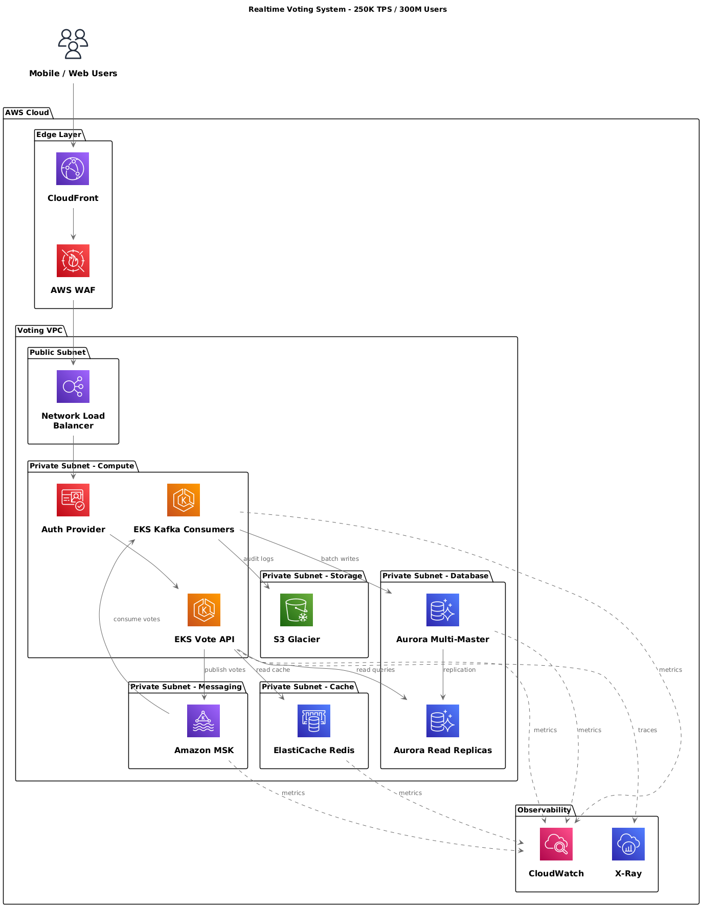
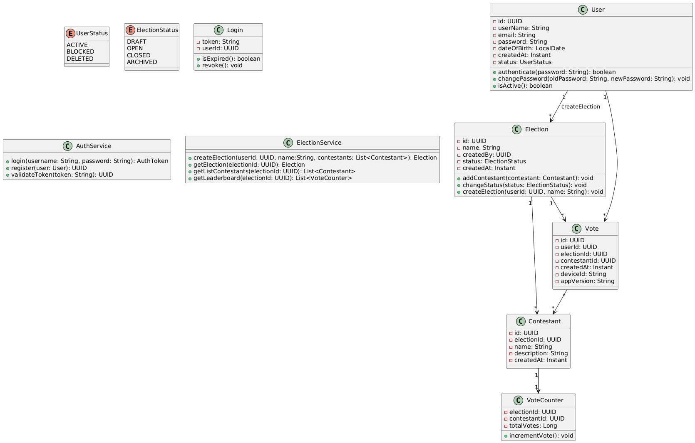

# 🧬 ARCHITECTURE KATA

## 🏛️ Structure

### 1. 🎯 Problem Statement and Context

What is the problem? What is the context of the problem?

We need to build a voting system for a huge tv show or event where 300 Million people might use it.  At the busiest moment, 250K people will vote every single second.The system cannot crash, cannot lose a single vote, and must show the results instantly when request, one person, one vote. No cheaters should be allowed.


Recomended Reading: http://diego-pacheco.blogspot.com/2021/10/breaking-problems-down.html

### 2. 🎯 Goals

- Handle the Traffic: the system must be strong enough to take 250k hits per second without breaking.
- Save Every Vote: When someone votes, we make sure it is saved safely before we tell them success.
- Stop Cheaters: We need security guards to block bots before they get in.
- Real-time speed: We need to send the vote count to everyone's phone instantly, like a live scoreboard.
- Stay Online: Even if part of the system breaks, the rest must keep working so people can still vote.
- No Double voting: We need to make sure nobody votes twice.

Recommended Learning: http://diego-pacheco.blogspot.com/2020/05/education-vs-learning.html

### 3. 🎯 Non-Goals

List in form of bullets what non-goals do have. Here it's great to have 5-10 lines.
Example:

- No monolith: We won't build one giant block of software. We will break it into small pieces so it's easier to manage.
- No mainframes: We wont use mainframe computers or keep servers in our own office. We will use Cloud (AWS).

Recommended Reading: http://diego-pacheco.blogspot.com/2021/01/requirements-are-dangerous.html

### 📐 3. Principles

List in form of bullets what design principles you want to be followed, it's great to have 5-10 lines.

1 - Event-Driven Architecture: Use asynchronous ingestion via a message broker (kafka/sqs) to decouple high-velocity writes from processing.

Recommended Reading: http://diego-pacheco.blogspot.com/2018/01/stability-principles.html

### 🏗️ 4. Overall Diagrams

Here there will be a bunch of diagrams, to understand the solution.

🗂️ 4.1 Overall architecture: Show the big picture, relationship between macro components.


🗂️ 4.2 Deployment: Show the infra in a big picture.



🗂️ 4.3 Use Cases: Make 1 macro use case diagram that list the main capability that needs to be covered.


Recommended Reading: http://diego-pacheco.blogspot.com/2020/10/uml-hidden-gems.html

### 🧭 5. Trade-offs

List the tradeoffs analysis, comparing pros and cons for each major decision.
Before you need list all your major decisions, them run tradeoffs on than.
example:
Major Decisions:

```
1. Two mobile code base - Mobile application should be developed in Swift to handle IOS and Kotlin for Android versions.
2. Backend application should be built using microservices separated by schema/domains instead of serveless approach.
3. Cache - Use AWS Elastic cache instead of Redis
```

Tradeoffs:

```
1. AWS Cognito vs Keycloak
2. AWS ECS vs AWS EKS
3. AWS KEYSPACES vs AWS RDS POSTGRES
4. Redis (Self-Hosted) vs AWS Elastic Cache
5. LiveKit vs WebRTC
```

## AWS Cognito vs Keycloak

AWS Cognito

```
PROS (+)
  * Setup and Maintenance: Easy to set up with managed service, minimal infra overhead.
  * Cost: Pricing based on MAUs (monthly active users), no server costs.
  * Integration: Tight integration with AWS (IAM, API Gateway, Lambda).
CONS (+)
  * Scalability: Bound to AWS regions and infra.
  * Customization: Branding and flow changes limited to AWS features.
  * Vendor Lock-in: Difficult to migrate away from AWS infra.
```

Keycloak

```
PROS (+)
  * Setup and Maintenance: Full control over installation, configuration, and setup.
  * Scalability: Can scale with Kubernetes/infra as needed.
  * Cost: Open-source, no license fees.
  * Customization: Fully customizable login, flows, and theming.
  * Integration: Works well across cloud and on-prem systems (OIDC, SAML, LDAP).
CONS (+)
  * Limitations: Full burden of upgrades and migration lies on you.
  * Security: Security depends on in-house team vigilance.
```

## Computation Scale

AWS EKS on Fargate
```
PROS (+) 
  * Management: No management, cluster simplicity with Fargate profiles.
  * Isolation: No cluster nodes, each pod runs in a micro-VM with Firecracker.
  * Billing: No capacity plan, pay per use, CPU and memory usage only.
  * Scaling: Auto scaling only in pods, more efficient and faster than node election.

CONS (+)
  * Customization: No DaemonSets, there are no EC2 nodes, and also a limited ephemeral disk (~20 GiB).
  * Observability: Agents must be sidecars on pods (instead of cluster-wide DaemonSets).
  * Cost: It can be more expensive than EC2 if you have heavy batch jobs or high compute throughput.
```

AWS ECS on Fargate
```
PROS (+) 
  * Zero infrastructure management: AWS handles provisioning, scaling, patching.
  * Isolation: Strong security boundary per task (ideal for multi-tenancy).
  * Pay-as-you-go: Billing is per vCPU and GiB-hour, no wasted capacity.
  * Auto-scaling: Tasks scale without cluster capacity planning.

CONS (+)
  * Feature limits: No privileged containers, host networking, GPUs.
  * Cost: More expensive for sustained or heavy workloads than EC2.
  * Quotas: Fargate launch throttles and ephemeral storage (~20 GiB default).
  * Observability: No DaemonSets — logging/monitoring agents must run as sidecars (extra cost overhead).
```
---

## Database

AWS RDS PostgreSQL
```
PROS (+) 
  * Scalability: Scales vertically and horizontally via Aurora read replicas.
  * Performance: Strong OLTP performance with indexes and joins.
  * Latency: Low-latency reads in multiple Regions
  
CONS (+)
  * Limitation: Must use RDS Proxy or pooling for apps with millions of users.
  * Operation: Still need to think about version upgrades, storage, scaling thresholds, and failover planning.
  * Multi-Region writes: Global database only supports fast cross-Region reads; writes go to one Region.
```

AWS DynamoDB
```
PROS (+) 
  * Performance: Single-digit millisecond latency at any scale(SSD-backed).
  * Scalability: Horizontal Scaling included by design, Automatic partitioning, trillions of items, 10M+ req/sec.
  * Availability: Built-in multi-AZ replication(multi-region, active-active).

CONS (+)
  * Performance: No Relational queries (no joins, no OR conditions)
  * Flexibility: Schema Less, requires careful (Partition Key/Sort Key) upfront data modeling, Query patterns must be known early.
  * Cost: Expensive if: high read/write rates, inefficient partition keys, large items >400kb
```

## AWS MSK (KAFKA) vs AWS SQS

AWS MSK (KAFKA)

```
PROS (+)
  * Debugging: Event streaming with replay/rewind
  * Scalability: High throughput
  * Consistency: Strict ordering per partition
  * Integration: Rich ecosystem (Kafka Streams, Flink, Connect)
CONS (+)
  * Overhead: Operational complexity
  * Cost: Costly at low/variable volume
```

AWS SQS

```
PROS (+)
  * Simplicity: Fully managed, zero ops
  * Cost: Pay-per-request pricing
  * Reliability: DLQs and retries built-in
  * Security: IAM integration + per-queue isolation
  * Automation: Tight AWS integration (Lambda, Step Functions)
CONS (+)
  * Duplication: At-least-once delivery only
```

## Redis (Self-Hosted) vs AWS Elastic Cache

Redis

```
PROS (+)
  * Performance: Redis offers multiple methods for caching data, which can significantly reduce data access latency and increase throughput.
CONS (+)
  * Cost: Redis clustering solutions needs to be done in-house and requires a significant amount of effort.
```

AWS Elastic Cache

```
PROS (+)
  * Setup and Maintenance: ElastiCache is a fully managed AWS service for Redis, not necessary to deal with ec2 instances and configs to install Redis.
CONS (+)
  * Limitations: ElastiCache runs only within the Amazon Web Services ecosystem, you may be concerned about vendor lock-in
```

---
## Tradeoffs Auth0 vs Ory Hydra+Kratos

AUTH0
```
PROS (+)
  * Setup: Fully managed SaaS, quick setup with minimal configuration.
  * Features: Comprehensive auth solution (login UI, MFA, social/enterprise SSO, user management, all included).
  * Integrations: Extensive pre-built integrations (100+ social/enterprise providers, SDKs for all major platforms).
  * Compliance: SOC 2, ISO 27001, GDPR-compliant out of the box.
  * Developer Experience: Rich documentation, pre-built UI components (Universal Login), extensive SDK ecosystem.
  * Time-to-Market: Near-instant deployment, no infrastructure management.

CONS (-)
  * Cost: Expensive at scale (pricing based on MAUs, can reach $10K+/month for high volume).
  * Vendor Lock-in: Proprietary APIs and data models make migration challenging.
  * Customization: Limited control over core flows, infrastructure, and data storage location.
  * Performance & control: Latency and behavior tied to Auth0 regions and infrastructure; limited tuning.
  * Data Sovereignty: User data stored in Auth0's infrastructure (compliance risk in some regions).
  * Flexibility: Difficult to implement non-standard OAuth flows or custom business logic.
```
ORY (HYDRA + KRATOS)
```
PROS (+)
  * Cost: Open source (Apache 2.0), self-hosted = free for unlimited users. Ory Network offers managed option.
  * Control: Full control over infrastructure, data residency, deployment topology.
  * Feature Completeness: Hydra (OAuth2/OIDC) + Kratos (identity/user management, registration, login, recovery, MFA, profile management).
  * Customization: Complete flexibility in UI/UX design, business logic, custom auth flows, and user journey.
  * Standards Compliance: Strict OAuth 2.0 and OpenID Connect implementation (Hydra is certified).
  * Performance: Deploy in your VPC/regions for optimal latency and data locality.
  * Scalability: Battle-tested at scale (millions of users), horizontal scaling, stateless architecture.
  * Modularity: Use both together or separately; integrate with existing systems; swap components as needed.

CONS (-)
  * Setup Complexity: Requires configuring two services (Hydra + Kratos) and building/customizing UIs using pre-built components.
  * Operations: Self-hosting means managing infrastructure, databases, monitoring, updates, security patches for both services.
  * Integration Work: Social logins and enterprise SSO require configuration and custom integration code.
  * Support: Community support only (unless paying for Ory Network or enterprise support).
  * Time-to-Market: Longer initial setup and customization compared to turnkey SaaS solutions.
```
## Tradeoffs SQL vs NoSql

SQL — Tradeoffs

```
PROS (+)
  * Consistency: Strong ACID guarantees, perfect for enforcing rules like `UNIQUE (election_id, voter_id)`.
  * Integrity: Native constraints (FK, UNIQUE, CHECK) prevent invalid states by design.
  * Transactions: Multi-row and multi-table transactions ensure atomic operations.
  * Joins: Efficient relational queries across users, voter identities, elections, and votes.
  * Maturity: Tooling, monitoring, migrations, and operational stability are excellent.
  * Auditability: Ideal for systems where every write must be traceable and deterministic.

CONS (-)
  * Scalability: Horizontal sharding is more complex than in many NoSQL databases.
  * Operational Overhead: Large relational schemas require careful indexing and tuning.
  * Flexibility: Schema changes (migrations) are more rigid and may require downtime windows.
  * Cost: At massive scale, distributed SQL clusters (e.g., Cockroach, Yugabyte) can be expensive.
  * Write Throughput: Not optimized for extremely high write rates per second (e.g., billions/hour) without sharding.
```

NoSQL — Tradeoffs

```
PROS (+)
  * Scalability: Designed for effortless horizontal scaling and very high write throughput.
  * Availability: Prioritizes uptime and partition tolerance (AP in CAP theorem).
  * Flexibility: Schema-less models allow rapid iteration without migrations.
  * Cost: Commodity hardware, auto-sharding, and simple replication can reduce infrastructure cost.
  * Distribution: Multi-region replication and low-latency access are usually built-in.

CONS (-)
  * Native Consistency: Lacks strong ACID semantics by default; eventual consistency is common.
  * Uniqueness: No native support for constraints like `UNIQUE (election_id, voter_id)` across shards.
  * Transactions: Limited or nonexistent multi-document or multi-collection transactions.
  * Integrity: Application must enforce invariants — error-prone and unsafe for voting systems.
  * Querying: Complex relational queries and joins are not supported or require manual composition.
  * Auditability: Harder to guarantee deterministic, tamper-proof, append-only records.
```

X-Ray x Jaeger

```
X-ray
  * Fully managed
  * No cluster to maintain, no upgrades, no tuning.
  * Deep integration with AWS
  * Automatic service maps
  * Very simple for those who are 100% AWS
  
  - Automatically instruments:
    API Gateway
    Lambda
    DynamoDB
    SQS / SNS
    ECS / EKS
    ALB / ELB

Jaeger
  * Open-source, CNCF standard
  * High compatibility with OpenTelemetry
  * Ideal for hybrid or self-hosted environments
  * No vendor lock-in
  * More flexible
  
  - Pluggable with:
    Grafana
    Prometheus
    Tempo
    Elastic
    Kafka
```

# AWS API Gateway

## Overall

Amazon API Gateway is an AWS service for creating, publishing, maintaining, monitoring, and securing REST, HTTP,
and WebSocket APIs at any scale. API developers can create APIs that access AWS or other web services, as well as
data stored in the AWS Cloud. As an API Gateway API developer, you can create APIs for use in your own client applications.

- Scalability Gateway limits
  - Default: 10,000 RPS
  - Burst: 5,000 requests
  - Can request limit increases via AWS Support (service quotas).
  - These throttle limits protect the entire service — if you exceed them, you will see error 429 (Too Many Requests).

- Throttle quota of entire AWS structure without access control per account per Region for a portal
  - 250,000 requests per second

These values can be increased?

1. Request a quota increase
  - Using Service Quotas
  - AWS typically allocates 100k+ RPS for large workloads

2. Distribute load by region
  - Each region has its own limit (you can use 20000 RPS splitting traffic between 5 regions for example)
  - Very common approach in global architectures

3. Use CloudFront in front of the API Gateway
  - Caching drastically reduces the number of requests
  - CloudFront does not count as a direct request to the API Gateway if cached

Link for Amazon API Gateway quotas: https://docs.aws.amazon.com/apigateway/latest/developerguide/limits.html

## Data size limits

- Payload (request/response body)
  - Maximum payload size: 10 MB — this is a hard limit set by API Gateway and cannot be increased.
  - For larger files, you can use S3 pre-signed URLs.

- HTTP Headers
  - Combined size of HTTP headers and lines: up to 10,240 bytes (approx. ~10 KB).

## Integration timeout

- By default, the maximum time the API Gateway expects for a response from your integration (e.g., Lambda, HTTP service, etc.) is approximately 29 seconds.
- This limit can be increased (upon request), especially for REST and private APIs, but may require adjustments to other quotas.

## Usage controls applicable by API or API Key

In addition to global account limits, you can set limits per API or per customer using Usage Plans:

- Set rate limits (requests/sec) per API key
- Set quotas per period (e.g., 100,000 requests per day)
- These per-client applied rules help control API access and usage.

## WebSocket Specific (Per API):
- Routes per API: 300 (can be increased).
- Stages per API: 10 (can be increased).
- Connections: No hard limit on concurrent connections, but there is a limit on new connections per second (around 500, adjustable).

# Endpoints:

### <span style='color:#3BC143 ;font-weight: bold;'>AUTHENTICATION</span>
method: <span style='color:#FFBE33;font-weight: bold;'>POST</span>
path: <span style='color:#FFBE33;font-weight: bold;'>v1/auth/login</span>
- User authentication endpoint usually used to identify the current user session and fetch user data. Response must return the user_id and user token.
  1. username and password are required fields
  - request
  ```json
  {
    "username" : "string",
    "password" : "string"    
  }
  ```
  - response
  ```json
  {
    "user_id" : "string",
    "token" : "string"
  }
  ```

### <span style='color:#3BC143 ;font-weight: bold;'>REGISTRATION</span>
method: <span style='color:#FFBE33;font-weight: bold;'>POST</span>
path: <span style='color:#FFBE33;font-weight: bold;'>v1/auth/register</span>
- User registration endpoint used to create a new user in the system. Response must return the user_id.
  1. Authorization header with Bearer token is required
  2. Fields username, password, email and date_of_birth are required
  3. Response code success must be 201 Created
  4. Response code failure for invalid fields must be 400 Bad Request
  5. Response code failure for unauthorized must be 401 Unauthorized
  - headers
  ```json
  {
    "Authorization" : "Bearer token"
  }
  ```
  - request
  ```json
  {
    "username" : "string",
    "password" : "string",
    "email" : "string",
    "date_of_birth" : "string"
  }
  ```
  - response
  ```json
  {
    "user_id" : "string"
  }
  ```

### <span style='color:#3BC143 ;font-weight: bold;'>CREATE EVENT</span>
method: <span style='color:#FFBE33;font-weight: bold;'>POST</span>
path: <span style='color:#FFBE33;font-weight: bold;'>v1/event/create</span>
- Endpoint to create a new voting event. Response must return the event_id, event_name and the list of contestants created.
  1. Authorization header with Bearer token is required
  2. Fields user_id, event_name, contestants, contestant_name, contestant_description, contestant_image_url are required
  3. Response code success must be 201 Created
  4. Response code failure for invalid fields must be 400 Bad Request
  5. Response code failure for unauthorized must be 401 Unauthorized
  - headers
  ```json
  {
    "Authorization" : "Bearer token"
  }
  ```
  - request
  ```json
  {
    "user_id": "string",
    "event_name": "string",
    "contestants": [
      {
        "contestant_name": "string",
        "contestant_description": "string",
        "contestant_image_url": "string"
      }
    ]
  }
  ```
  - response
  ```json
  {
    "event_id" : "string",
    "event_name": "string",
    "contestants": [
      {
        "contestant_id": "string",
        "contestant_name": "string"
      }
    ]
  }
  ```

### <span style='color:#3BC143 ;font-weight: bold;'>GET EVENT LEADERBOARD</span>
method: <span style='color:#FFBE33;font-weight: bold;'>GET</span>
path: <span style='color:#FFBE33;font-weight: bold;'>v1/event/{event_id}/leaderboard</span>
- Endpoint to get the leaderboard of a given event. Response must return the event_id, event_name and the list of contestants with their total votes.
  1. Authorization header with Bearer token is required
  2. Field event_id is required
  3. Response code success must be 200 OK
  4. Response code failure for invalid fields must be 400 Bad Request
  5. Response code failure for unauthorized must be 401 Unauthorized
  6. Response code failure event_id not found must be 404 Not Found
  - headers
  ```json
  {
    "Authorization" : "Bearer token"
  }
  ```
  - response
  ```json
  {
    "event_id" : "string",
    "event_name" : "string",
    "contestants": [
      {
        "contestant_id": "string",
        "contestant_name": "string",
        "total_votes": "Integer"
      }
    ]
  }
  ```

### <span style='color:#3BC143 ;font-weight: bold;'>GET CONTESTANTS LIST</span>
method: <span style='color:#FFBE33;font-weight: bold;'>GET</span>
path: <span style='color:#FFBE33;font-weight: bold;'>v1/contestants/{event_id}</span>
- Endpoint to get the list of contestants for a given event. Response must return the event_id and the list of contestants.
  1. Authorization header with Bearer token is required
  2. Url parameter field event_id is required
  3. Response code success must be 200 OK
  4. Response code failure for invalid fields must be 400 Bad Request
  5. Response code failure for unauthorized must be 401 Unauthorized
  6. Response code failure for event_id not found must be 404 Not Found
  - headers
  ```json
  {
    "Authorization" : "Bearer token"
  }
  ```
  - response
  ```json
  {
    "event_id" : "string",
    "contestants": [
      {
        "contestant_id": "string",
        "contestant_name": "string",
        "contestant_image_url": "string"
      }
    ]
  }
  ```

### <span style='color:#3BC143 ;font-weight: bold;'>SUBMIT A VOTE</span>
method: <span style='color:#FFBE33;font-weight: bold;'>POST</span>
path: <span style='color:#FFBE33;font-weight: bold;'>v1/vote/submit</span>
- Endpoint to submit a vote for a given event. Response must return the vote_id.
  1. Authorization header with Bearer token is required
  2. Fields user_id, event_id, contestant_id are required
  3. Response code success must be 200 OK
  4. Response code failure for invalid fields must be 400 Bad Request
  5. Response code failure for unauthorized must be 401 Unauthorized
  6. Response code failure for contestant_id and/or event_id not found must be 404 Not Found
  7. Response code failure for duplicate vote must be 409 Conflict
  - headers
  ```json
  {
    "Authorization" : "Bearer token"
  }
  ```
  - request
  ```json
  {
    "user_id": "string",
    "event_id": "string",
    "contestant_id": "string",
    "client_timestamp": "string",
    "meta": {
        "device_id": "string",
        "app_version": "string"
    }
  }
  ```
  - response
  ```json
  {
    "vote_id" : "string"
  }
  ```

**Final Bottom Line**

For a system where **one person must vote exactly once**, and where **data integrity is non-negotiable**, SQL is clearly superior.

---

## LiveKit vs WebRTC (self hosted)

LiveKit

```
PROS (+)
  * Scalability: Designed with cloud-native scaling in mind; Kubernetes-ready with multi-node support and autoscaling.
  * Setup and Maintenance: Easy to deploy with prebuilt Docker images and Helm charts. Managed cloud option available (LiveKit Cloud).
  * Availability: LiveKit Cloud offers high availability out of the box with managed infrastructure and SLAs.
CONS (+)
  * Complexity: Abstracted logic limits low-level control. Custom media routing or deep protocol tweaks are not straightforward.
  * Cost: LiveKit Cloud can become expensive at scale compared to self-hosted SFUs like MediaSoup.
```

WebRTC

```
PROS (+)
  * Scalability: Can scale with custom SFU (Selective Forwarding Unit) setup.
  * Optimization: Can deeply optimize SFU settings.
CONS (+)
  * Setup and Maintenance: Must build it from scratch. Must self-host, integrate, and configure.
  * Security: You are Responsible for correct, secure and authentication setups.
```

PS: Be careful to not confuse problem with explanation.
<BR/>Recommended reading: http://diego-pacheco.blogspot.com/2023/07/tradeoffs.html

### 🌏 6. For each key major component

What is a majore component? A service, a lambda, a important ui, a generalized approach for all uis, a generazid approach for computing a workload, etc...

## 6.1 - Class Diagram



## 6.2 - Contract Documentation

- We must use OAuth 2.0 to access/refresh tokens
- We must use REST API
- We must use AWS Gateway

> **USER**

### <span style='color:#3BC143 ;font-weight: bold;'>LOGIN</span>

method: <span style='color:#FFBE33;font-weight: bold;'>POST</span>
path: <span style='color:#FFBE33;font-weight: bold;'>v1/login</span>

- User authentication endpoint usually used to identify the current user session and fetch user data. Response must return the userId and user token.
  1. username and password are required fields
  - request
  ```json
  {
    "username": "string",
    "password": "string"
  }
  ```
  - response
  ```json
  {
    "userId": "string",
    "token": "string"
  }
  ```

### <span style='color:#3BC143 ;font-weight: bold;'>LOGOUT</span>

method: <span style='color:#FFBE33;font-weight: bold;'>POST</span>
path: <span style='color:#FFBE33;font-weight: bold;'>v1/logout</span>

- Invalidate user session
  1. username is required
  - request
  ```json
  {
    "username": "string"
  }
  ```
  - response
  ```json
  {
    success : boolean
  }
  ```

### <span style='color:#3BC143 ;font-weight: bold;'>CREATE_USER_ACCOUNT</span>

method: <span style='color:#FFBE33;font-weight: bold;'>POST</span>
path: <span style='color:#FFBE33;font-weight: bold;'>v1/account</span>

- Create user account allowing the user to log into the app.
  1. first name is required
  2. firstName is required
  3. lastName is required
  4. email is required
  5. username is required
  6. password is required
  7. Account status account_status should be updated to C (require confirmation). update account update_date column with the current date
  8. After account creation user must receive an email to confirm this account
  9. After account confirmation user account_status should be updated to A (active). update account update_date column with current date
  10. After these steps user can log into app
  - request
  ```json
  {
    firstName : "string",
    lastName : "string",
    email : "string"
    username : "string"
    password : "string"
  }
  ```
  - response
  ```json
  {
    id: long
    account_status: "string"
  }
  ```

### <span style='color:#3BC143 ;font-weight: bold;'>USER_PROFILE</span>

method: <span style='color:#FFBE33;font-weight: bold;'>POST</span>
path: <span style='color:#FFBE33;font-weight: bold;'>v1/account/profile</span>

- Create user profile allowing the user create/update user settings, privacy and notifications
  1. user_id is required
  - request
  ```json
  {
    "user_id": "string"
  }
  ```
  - response
  ```json
  {
    "firstName": "string",
    "lastName": "string",
    "email": "string",
    "picture": "string"
  }
  ```

### <span style='color:#3BC143 ;font-weight: bold;'>FIND_USER</span>

method: <span style='color:#FFBE33;font-weight: bold;'>GET</span>
path: <span style='color:#FFBE33;font-weight: bold;'>v1/user</span>

- Fetch user by username or user_id,
  1. To fetch user information , you must add to the payload the user_id or username
  - request
  ```json
  {
    "user_id": "string",
    "username": "string"
  }
  ```
  - response
  ```json
  {
    "firstName": "string",
    "lastName": "string",
    "email": "string",
    "picture": "string",
    "status": "string"
  }
  ```

### <span style='color:#3BC143 ;font-weight: bold;'>FIND_USER_NOTIFICATIONS</span>

method: <span style='color:#FFBE33;font-weight: bold;'>GET</span>
path: <span style='color:#FFBE33;font-weight: bold;'>v1/user/notification</span>

- Get last user notifications by user_id sorted by created date
  1. This service should limit 50, you must pass this limit in the payload request
  2. You must pass an offset to the payload to paginate the notification list
  3. user_id is required, limit default value is 50, offset default value is zero
  - request
  ```json
  {
    user_id : "string"
    limit : integer
    offset: integer
  }
  ```
  - response
  ```json
  {
    "notifications": []
  }
  ```

### <span style='color:#3BC143 ;font-weight: bold;'>FIND_USER_MESSAGES</span>

method: <span style='color:#FFBE33;font-weight: bold;'>GET</span>
path: <span style='color:#FFBE33;font-weight: bold;'>v1/user/messages</span>

- Fetch user messages by user_id and room_id and sort it by created date
  1. user_id is required
  2. room_id is required
  3. It will fetch all active user messages
  - request
  ```json
  {
    user_id : "string"
    room_id :integer
  }
  ```
  - response
  ```json
  {
    "messages": []
  }
  ```

### <span style='color:#3BC143 ;font-weight: bold;'>REMOVE_USER_MESSAGES</span>

method: <span style='color:#FFBE33;font-weight: bold;'>POST</span>
path: <span style='color:#FFBE33;font-weight: bold;'>v1/user/messages</span>

- This endpoint will provide a soft delete of user messages updating the message_status to R (Removed)

  1. user_id is required
  2. messages_id - list of messages_id

  - request

  ```json
  {
    user_id : long
    messages_id : []
  }
  ```

  - response

  ```json
  {
    success boolean
  }
  ```

### <span style='color:#3BC143 ;font-weight: bold;'>UPDATE_STATUS</span>

method: <span style='color:#FFBE33;font-weight: bold;'>POST</span>
path: <span style='color:#FFBE33;font-weight: bold;'>v1/user/status</span>

- Update user status to ONLINE or OFFLINE
  - request
  ```json
  {
    status : int
  }
  ```
  - response
  ```json
  {
    success : boolean
  }
  ```

### <span style='color:#3BC143 ;font-weight: bold;'>UPDATE_PICTURE</span>

method: <span style='color:#FFBE33;font-weight: bold;'>POST</span>
path: <span style='color:#FFBE33;font-weight: bold;'>v1/user/picture</span>

- Upload the user profile picture

  1. user_id is required
  2. image is required, this image must be encoded in base64

  - request

  ```json
  {
    "user_id": "string",
    "image": "string"
  }
  ```

  - response

  ```json
  {
    "success": "boolean"
  }
  ```

**BILLING**

### <span style='color:#3BC143 ;font-weight: bold;'>PAYMENT</span>

method: <span style='color:#FFBE33;font-weight: bold;'>POST</span>
path: <span style='color:#FFBE33;font-weight: bold;'>v1/payment</span>

- Perform payment of subscription purchase using payment gateway

  1. tenant_id is required
  2. total is required
  3. payment_gateway is required

  - request

  ```json
  {
    "tenant_id": "string",
    "total": "float",
    "payment_gateway": "string"
  }
  ```

  - response

  ```json
  {
    success boolean
  }
  ```

> **DOJO**

### <span style='color:#3BC143 ;font-weight: bold;'>CREATE_DOJO_ROOM</span>

method: <span style='color:#FFBE33;font-weight: bold;'>POST</span>
path: <span style='color:#FFBE33;font-weight: bold;'>v1/dojo/create</span>

- Create a Dojo Room for a tenant

  1. tenant_id is required
  2. schedule date for a session
  3. team members
  4. subject

  - request

  ```json
  {
    tenant_id: "long",
    dojo_date: "date"
    members: [],
    subject: "string"
  }
  ```

  - response

  ```json
  {
    dojo_id long
  }
  ```

### <span style='color:#3BC143 ;font-weight: bold;'>START_DOJO</span>

method: <span style='color:#FFBE33;font-weight: bold;'>POST</span>
path: <span style='color:#FFBE33;font-weight: bold;'>v1/dojo/start</span>

- Start a Recording of a Dojo session

  1. tenant_id is required
  2. dojo_id is required

  - request

  ```json
  {
    "tenant_id": "long",
    "dojo_id": "long"
  }
  ```

  - response

  ```json
  {
    success boolean
  }
  ```

### <span style='color:#3BC143 ;font-weight: bold;'>STOP_DOJO</span>

method: <span style='color:#FFBE33;font-weight: bold;'>POST</span>
path: <span style='color:#FFBE33;font-weight: bold;'>v1/dojo/stop</span>

- Stop a record of a Dojo Room session

  1. tenant_id is required
  2. dojo_id is required

  - request

  ```json
  {
    "tenant_id": "string",
    "dojo_id": "long"
  }
  ```

  - response

  ```json
  {
    success boolean
  }
  ```

> **REPORT**

### <span style='color:#3BC143 ;font-weight: bold;'>ANUAL_REPORT</span>

method: <span style='color:#FFBE33;font-weight: bold;'>POST</span>
path: <span style='color:#FFBE33;font-weight: bold;'>v1/report/anual</span>

- Generate an anual report for entire year from specific tenant

  1. tenant_id is required

  - request

  ```json
  {
    tenant_id long
  }
  ```

  - response

  ```json
  {
    report_id: long
  }
  ```

### <span style='color:#3BC143 ;font-weight: bold;'>REPORT_BILLING</span>

method: <span style='color:#FFBE33;font-weight: bold;'>POST</span>
path: <span style='color:#FFBE33;font-weight: bold;'>v1/report/billing</span>

- Generate a Billing report for a specific tenant

  1. tenant_id is required

  - request

  ```json
  {
    "tenant_id": "string"
  }
  ```

  - response

  ```json
  {
    report_id: long
  }
  ```

#### 6.3 Persistence Model

### **User**

| NAME      | TYPE      | SIZE | NOT NULL | DEFAULT           | DESCRIPTION                 |
| --------- | --------- | ---- | -------- | ----------------- | --------------------------- |
| id        | uuid      |      | NO       |                   | uuid primary key            |
| tenantid  | uuid      |      | NO       |                   | uuid user table             |
| username  | varchar   | 15   | NO       |                   | username must have an index |
| firstname | varchar   | 30   | NO       |                   |                             |
| lastname  | varchar   | 30   | NO       |                   |                             |
| email     | varchar   | 50   | NO       |                   |                             |
| age       | tinyint   | 3    | NO       |                   |                             |
| created   | timestamp |      | NO       | current_timestamp |                             |
| updated   | timestamp |      | NO       | current_timestamp |                             |

### **Room**

- PRIMARY KEY (userid, created)

| NAME     | TYPE      | SIZE | NOT NULL | DEFAULT           | DESCRIPTION             |
| -------- | --------- | ---- | -------- | ----------------- | ----------------------- |
| id       | uuid      |      | NO       |                   | uuid primary key        |
| userid   | uuid      |      | NO       |                   | uuid user table         |
| tenantid | uuid      |      | NO       |                   | uuid user table         |
| date     | timestamp |      | NO       |                   | Dojo scheduled date     |
| name     | varchar   | 50   | NO       |                   | name must have an index |
| status   | varchar   | 1    | NO       | A                 | A-Active, I-Inactive    |
| created  | timestamp |      | NO       | current_timestamp |                         |
| updated  | timestamp |      | NO       | current_timestamp |                         |

### **Billing**

- PRIMARY KEY (tenantid, paymentgateway)

| NAME           | TYPE      | SIZE | NOT NULL | DEFAULT           | DESCRIPTION              |
| -------------- | --------- | ---- | -------- | ----------------- | ------------------------ |
| id             | uuid      |      | NO       |                   | uuid primary key         |
| tenantid       | uuid      |      | NO       |                   | uuid user table          |
| plan           | varchar   | 15   | NO       |                   | M - monthly - Y - yearly |
| price          | float     | 10   | NO       | A                 | Total amount             |
| expirationdate | timestamp |      | NO       |                   | Expiration date plan     |
| autorenew      | integer   | 1    | NO       |                   | 0 - NO - 1 - YES         |
| paymentgateway | varchar   | 10   | NO       |                   | Payment gateway name     |
| created        | timestamp |      | NO       | current_timestamp |                          |
| updated        | timestamp |      | NO       | current_timestamp |                          |

### **PocUser**

- PRIMARY KEY (userid, tenantid, created)

| NAME     | TYPE      | SIZE | NOT NULL | DEFAULT           | DESCRIPTION                    |
| -------- | --------- | ---- | -------- | ----------------- | ------------------------------ |
| id       | uuid      |      | NO       |                   | uuid                           |
| userid   | uuid      |      | NO       |                   | uuid user table                |
| tenantid | uuid      |      | NO       |                   | uuid user table                |
| name     | varchar   |      | NO       |                   | POC Name                       |
| language | uuid      |      | NO       |                   | POC languages e.g java, js, GO |
| favorite | integer   | 1    | NO       | N                 | N - NO - Y - YES               |
| tags     | varchar   | 255  | NO       |                   | POC Tags                       |
| repourl  | varchar   | 255  | NO       |                   | POC Repo URL                   |
| created  | timestamp |      | NO       | current_timestamp |                                |
| updated  | timestamp |      | NO       | current_timestamp |                                |

Note: Cassandra database does not have a column size property. We must limit the number of characters on the application side.

- AWS POSTGRESQL REPORT TABLE

```sql
CREATE TABLE reports (
    id SERIAL PRIMARY KEY, -- SERIAL to auto-increment as a primary key
    user_id STRING NOT NULL, -- UUID User id comming from Cassandra tables
    created_date TIMESTAMP DEFAULT CURRENT_TIMESTAMP, -- Date to inform when the report was generated
    report_type VARCHAR(50) NOT NULL -- Column to inform the report type - BILLING, DOJOS, USERS
);
```

#### 6.4 - Algorithms/Data Structures : Specific algos that need to be used, along size with spesific data structures.

- Circuit breaker Pattern
- Retry with backoff
- Queue for message notifications
- REDIS SET data structure for POCs Caching.

Samples of other components: Batch jobs, Events, 3rd Party Integrations, Streaming, ML Models, ChatBots, etc...

Recommended Reading: http://diego-pacheco.blogspot.com/2018/05/internal-system-design-forgotten.html

### 🖹 7. Migrations

IF Migrations are required describe the migrations strategy with proper diagrams, text and tradeoffs.

- N/A

### 🖹 8. Testing strategy

Explain the techniques, principles, types of tests and will be performaned, and spesific details how to mock data, stress test it, spesific chaos goals and assumptions.

- Manual testing - Involves manual inspection and testing of the software by a human tester.
- Automated testing - software tools to automate the testing process
- Unit testing - Tests individual units or components of the software to ensure they are functioning as intended.
- Integration testing - Tests the integration of different components of the software to ensure they work together as a system.
- Regression testing – Tests the software after changes or modifications have been made to ensure the changes have not introduced new defects.
- Performance testing - Tests the software to determine its performance characteristics such as speed, scalability, and stability.
- Security testing – Tests the software to identify vulnerabilities and ensure it meets security requirements.
- Usability testing – Tests the software to evaluate its user-friendliness and ease of use.

### 🖹 9. Observability strategy

Explain the techniques, principles,types of observability that will be used, key metrics, what would be logged and how to design proper dashboards and alerts.

- Dojo system will generated service metrics , the metrics will be consumed by Prometheus,Grafana and Loki stack
- Grafana will provide customized dashboards to identify errors , alerts and also providing ways to troubleshoot
- Metrics dashboards should contain errors,alert identifying any service errors

### 🖹 10. Data Store Designs

For each different kind of data store i.e (Postgres, Memcached, Elasticache, S3, Neo4J etc...) describe the schemas, what would be stored there and why, main queries, expectations on performance. Diagrams are welcome but you really need some dictionaries.

- AWS S3 for videos, images, text files, reports
- AWS RDS Postgres for structured data
- AWS Elastic cache for caching data
- AWS Keyspaces (Apache Cassandra)

### **AWS Keyspaces (Cassandra) Queries**

- Find user

```sql
SELECT id, username, firstname, lastname, email, age, created, updated FROM app.user where id = ?;
```

- Find poc by name

```sql
SELECT id, name, language, description, favorite, tags FROM app.pocuser where userid = ? and name = ?;
```

- Find poc by language

```sql
SELECT id, name, language, description, favorite, tags FROM app.pocuser where userid = ? and language = ?;
```

- Find poc by tag

```sql
SELECT id, name, language, description, favorite, tags FROM app.pocuser where userid = ? and tag = ?;
```

- Find room by user, userid and created date

```sql
select currentDate(), dateof(now()), id, userid, name, created from app.room where userid = ? AND created >= ? - 1d;
```

### 🖹 11. Technology Stack

Describe your stack, what databases would be used, what servers, what kind of components, mobile/ui approach, general architecture components, frameworks and libs to be used or not be used and why.

- Android UI: Kotlin
- IOS UI: Swift
- Language: Java 23
- Framework: Spring Boot 3
- Container: Docker
- Orchestration: EKS Kubernetes
- API: REST
- Auth: OAuth2 + JWT
- Databases: AWS Keyspaces (Cassandra) PostgreSQL + Redis
- Messaging: Kafka (AWS MSK)
- CI/CD: GitHub Actions + ArgoCD
- Monitoring: Prometheus + Grafana
- Logging: Loki
- Tracing: Xray
- Realtime video - NodeJS + WebRTC

### 🖹 12. References

- Architecture Anti-Patterns: https://architecture-antipatterns.tech/
- EIP https://www.enterpriseintegrationpatterns.com/
- SOA Patterns https://patterns.arcitura.com/soa-patterns
- API Patterns https://microservice-api-patterns.org/
- Anti-Patterns https://sourcemaking.com/antipatterns/software-development-antipatterns
- Refactoring Patterns https://sourcemaking.com/refactoring/refactorings
- Database Refactoring Patterns https://databaserefactoring.com/
- Data Modelling Redis https://redis.com/blog/nosql-data-modeling/
- Cloud Patterns https://docs.aws.amazon.com/prescriptive-guidance/latest/cloud-design-patterns/introduction.html
- 12 Factors App https://12factor.net/
- Relational DB Patterns https://www.geeksforgeeks.org/design-patterns-for-relational-databases/
- Rendering Patterns https://www.patterns.dev/vanilla/rendering-patterns/
- REST API Design https://blog.stoplight.io/api-design-patterns-for-rest-web-services
