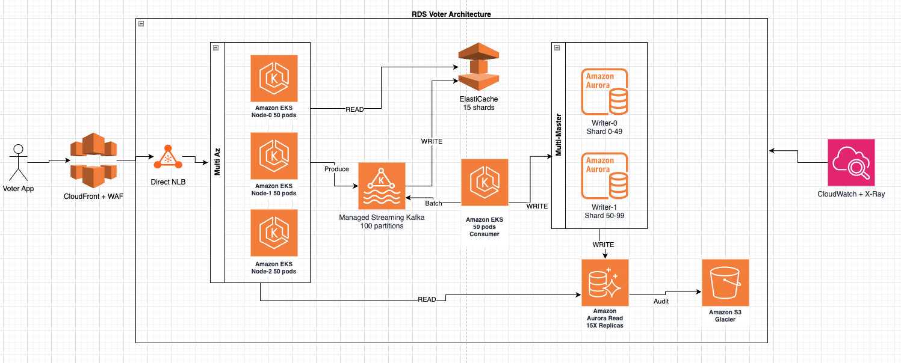
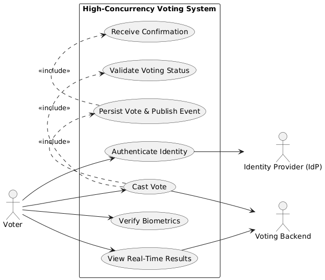
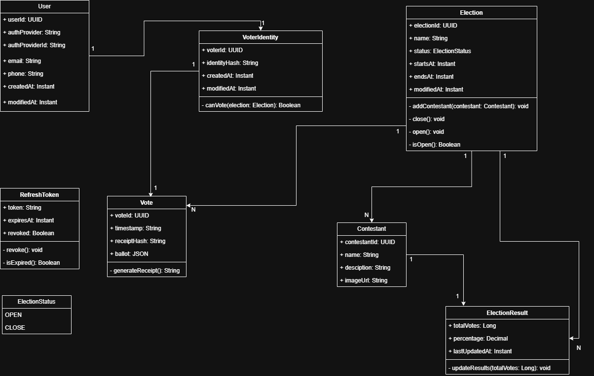

# 🧬 ARCHITECTURE KATA

## 🏛️ Structure

### 1. 🎯 Problem Statement and Context

Build a voting system for a huge tv show or event where 300 Million people might use it. Voting system cannot crash, lose votes, real time results, consistent 

1. Realtime voting
2. 250.000 request per second
3. Secure against bots, hackers
4. Availability, Realibility
5. Request one vote per person
6. Realtime results


### 2. 🎯 Goals

- **Handle the Traffic:** the system must be strong enough to take 250k hits per second without breaking.
- **Save Every Vote:** When someone votes, we make sure it is saved safely before we tell them success.
- **Stop Cheaters:** We need security guards to block bots before they get in.
- **Real-time speed:** We need to send the vote count to everyone's phone instantly, like a live scoreboard.
- **Stay Online:** Even if part of the system breaks, the rest must keep working so people can still vote.
- **No Double voting:** We need to make sure nobody votes twice.

Recommended Learning: http://diego-pacheco.blogspot.com/2020/05/education-vs-learning.html

### 3. 🎯 Non-Goals

List in form of bullets what non-goals do have. Here it's great to have 5-10 lines.
Example:

- **No monolith:** We won't build one giant block of software. We will break it into small pieces so it's easier to manage.
- **No mainframes:** We wont use mainframe computers or keep servers in our own office. We will use Cloud (AWS).
- **No Heavy Business Logic:** The app won't calculate totals or validate global vote limits; it remains a "thin client" focused on UI and local input validation.
- **No Local Truth:** Local storage (Hive/SharedPrefs) will not be the source of truth for a "successful vote"—only the server's signed acknowledgment counts.
- **No Custom Cryptography:** We won’t build our own encryption algorithms; we will strictly use platform-standard Secure Enclave (iOS) and Keystore (Android).

Recommended Reading: http://diego-pacheco.blogspot.com/2021/01/requirements-are-dangerous.html

### 📐 3. Principles

List in form of bullets what design principles you want to be followed, it's great to have 5-10 lines.

1. **Event-Driven Architecture:** Use asynchronous ingestion via a message broker (kafka/sqs) to decouple high-velocity writes from processing.

2. **Optimistic UI Updates:** Provide the user with immediate visual confirmation of their vote while the actual sync happens asynchronously in the background.
3. **Reactive State Management:** Use BLoC or Signals to ensure the UI reacts instantly to backend streams without unnecessary full-screen rebuilds.
4. **Hardware-Backed Security:** Leverage Native Channels to access biometric hardware, ensuring the "one-person-one-vote" rule is tied to the physical device.
5. **Graceful Degradation:** If the network is congested, the app should automatically disable heavy animations and simplify the UI to prioritize the voting action.

Recommended Reading: http://diego-pacheco.blogspot.com/2018/01/stability-principles.html

### 🏗️ 4. Overall Diagrams

Here there will be a bunch of diagrams, to understand the solution.

🗂️ 4.1 Overall architecture: Show the big picture, relationship between macro components.


# Model #1 - RDS Voter System Architecture Analysis - for 250K TPS

## Architecture Overview

This architecture is designed to handle a high-throughput voter system capable of processing **250,000 transactions per second (TPS)**. The design uses a modern AWS stack with event-driven architecture, distributed caching, and multi-master database configuration.




## Component Analysis

### 1. CloudFront + WAF

**Purpose**: Content delivery network and application firewall for DDoS protection and global distribution.

#### Pros

- Global edge locations reduce latency for distributed voters
- WAF protects against Layer 7 attacks, SQL injection, XSS
- Built-in DDoS protection with AWS Shield Standard (free)
- Offloads static content delivery from origin
- SSL/TLS termination at edge reduces backend load
- Request filtering before reaching backend (saves compute costs)

#### Cons

- Adds ~50-100ms latency for cache misses
- Additional cost for data transfer and requests
- Cache invalidation complexity for real-time voting updates
- WAF rules require tuning to avoid false positives
- Not suitable if all requests must hit backend (no caching benefit)

#### Trade-offs

- **Security vs Latency**: WAF inspection adds processing time but protects against attacks
- **Cost vs Performance**: CloudFront costs can be high at 250K TPS but reduces origin load
- **Caching vs Freshness**: Aggressive caching saves costs but may serve stale data
  **Cost Estimate**: ~$2,000-5,000/month (250K requests/sec = 648B requests/month at $0.0075/10K requests + data transfer)

---

### 2. Network Load Balancer (NLB)

**Purpose**: High-performance Layer 4 load balancer for distributing traffic to EKS nodes.

#### Pros

- Handles millions of requests per second with ultra-low latency (<100μs)
- Preserves source IP address for accurate voter tracking
- Static IP addresses for DNS and whitelist configurations
- Connection-based routing (not request-based like ALB)
- Cross-zone load balancing for high availability
- Lower cost than ALB for high throughput

#### Cons

- No Layer 7 features (no HTTP routing, headers, cookies)
- No native WAF integration (must use CloudFront WAF)
- Limited health check options compared to ALB
- Cannot route based on URL paths or hostnames
- No built-in authentication (OAuth, Cognito)

#### Trade-offs

- **Performance vs Features**: NLB is faster but lacks ALB's Layer 7 capabilities
- **Cost vs Throughput**: At 250K TPS, NLB is more cost-effective than ALB
- **Simplicity vs Flexibility**: Connection-based routing is simpler but less flexible

**Cost Estimate**: ~$200-300/month (NLB hours + LCU charges)

---

### 3. Amazon EKS (Multi-AZ - 3 Nodes, 150 Pods Total)

**Purpose**: Container orchestration for running voter application microservices with high availability.

#### Pros

- Managed Kubernetes with automatic updates and patching
- Multi-AZ deployment ensures high availability
- Auto-scaling (HPA and Cluster Autoscaler) handles traffic spikes
- Native integration with AWS services (IAM, CloudWatch, VPC)
- Rolling updates with zero downtime
- Resource isolation per pod (CPU, memory limits)
- 50 pods per node = efficient resource utilization

#### Cons

- Complexity: Kubernetes has steep learning curve
- Cost: Control plane costs $0.10/hour ($73/month) per cluster
- Over-provisioning: 150 pods may be excessive for some workloads
- Networking overhead with service mesh/CNI plugins
- Requires DevOps expertise for production operations
- Startup time slower than serverless alternatives (Lambda)

#### Trade-offs

- **Flexibility vs Simplicity**: EKS offers container flexibility but adds operational complexity
- **Cost vs Control**: More expensive than Fargate but allows fine-grained node control
- **Scalability vs Overhead**: Powerful scaling but requires careful resource management

**Cost Estimate**:

- Control plane: $73/month
- 3 x m5.2xlarge nodes: ~$1,850/month (3 x $0.384/hour x 730 hours)
- **Total**: ~$1,923/month (base configuration)

---

### 4. Amazon MSK (Managed Streaming for Apache Kafka - 100 Partitions)

**Purpose**: Event streaming platform for asynchronous vote processing and decoupling producers from consumers.

#### Pros

- Fully managed Kafka (no ZooKeeper management in MSK 2.8+)
- High throughput: Each broker handles 40MB/s ingress, 60MB/s egress
- 100 partitions enable massive parallelism for consumers
- Durability: Multi-AZ replication with configurable retention (default 7 days)
- Integrates with AWS IAM for authentication
- Event replay capability for auditing and recovery
- Decouples API layer from database writes (async processing)

#### Cons

- Cost: MSK is expensive (~$200/month per broker, minimum 3 brokers)
- Complexity: Requires Kafka expertise for tuning (partitions, retention, compression)
- Latency: Async processing adds delay (not suitable for real-time consistency)
- Over-provisioning: 100 partitions may be excessive if consumers can't keep up
- Partition rebalancing can cause temporary slowdowns
- No serverless option (must provision broker capacity)

#### Trade-offs

- **Throughput vs Cost**: 100 partitions provide massive throughput but require more brokers
- **Async vs Sync**: Event-driven architecture improves scalability but adds eventual consistency
- **Durability vs Storage**: Longer retention periods increase storage costs
  **Cost Estimate**: ~$1,650/month (3 x kafka.m5.xlarge brokers + storage)

---

### 5. ElastiCache Redis (15 Shards)

**Purpose**: Distributed in-memory cache for read-heavy operations and session management.

#### Pros

- Sub-millisecond latency for reads (reduces Aurora load by 80-90%)
- 15 shards enable horizontal scaling to ~750GB memory
- Cluster mode provides automatic sharding and replication
- Multi-AZ with automatic failover (<30 seconds)
- Supports complex data structures (sorted sets for leaderboards)
- Read replicas per shard for read scaling
- Reduces database costs by caching frequent queries

#### Cons

- Cost: ElastiCache is expensive (~$150-300/node depending on instance type)
- Cache invalidation complexity (requires careful strategy)
- Cold start: Empty cache leads to "thundering herd" on database
- Not suitable for durable storage (data can be lost on failover)
- 15 shards may be over-provisioned for workload
- Network overhead for cluster mode vs single node

#### Trade-offs

- **Performance vs Cost**: In-memory speed is expensive at scale
- **Consistency vs Availability**: Cache can serve stale data during invalidation
- **Sharding vs Simplicity**: 15 shards improve throughput but increase operational complexity
  **Cost Estimate**: ~$6,750/month (15 shards x 3 nodes x cache.r6g.xlarge at $0.308/hour)

---

### 6. Amazon EKS Consumer (50 Pods)

**Purpose**: Dedicated consumer pods for processing Kafka messages and writing to Aurora.

#### Pros

- Separation of concerns: Decouples API layer from write processing
- 50 consumers can process 100 partitions with 2 partitions per consumer
- Batch processing improves database write throughput (bulk inserts)
- Independent scaling from API layer
- Retry logic and dead letter queue handling
- Enables complex event processing (aggregations, enrichment)

#### Cons

- Additional infrastructure cost (separate EKS deployment)
- Increased complexity with two EKS clusters/deployments
- Consumer lag monitoring required
- Potential message processing delays under load
- 50 pods may be over-provisioned or under-provisioned depending on throughput

#### Trade-offs

- **Throughput vs Latency**: Batch processing improves throughput but adds delay
- **Parallelism vs Overhead**: More consumers increase throughput but add coordination overhead
- **Resilience vs Complexity**: Consumer group management adds complexity but improves fault tolerance
  **Cost Estimate**: Included in EKS cluster cost (uses same cluster, different deployment)

---

### 7. Amazon Aurora Multi-Master (2 Writers, Sharded 0-99)

**Purpose**: Multi-master database configuration for distributed writes and eliminating write bottlenecks.

#### Pros

- **True active-active**: Both writers accept writes simultaneously (no primary/replica)
- Eliminates single-writer bottleneck (can handle 2x write throughput)
- Sharding (0-49, 50-99) enables horizontal write scaling
- Automatic failover between masters (<30 seconds)
- ACID compliance for transactional integrity
- Built-in replication to read replicas
- Storage auto-scales up to 128TB per cluster

#### Cons

- **Cost**: Multi-Master is 2x cost of single-writer Aurora
- **Conflict resolution**: Application must handle write conflicts (last-write-wins)
- Complexity: Requires application-level shard routing logic
- Limited to 4 writer nodes maximum (not truly unlimited scaling)
- Higher latency than single-writer due to conflict detection
- Not all Aurora features supported (e.g., Global Database)
- Write conflicts can cause transaction retries

#### Trade-offs

- **Write Throughput vs Complexity**: Multi-Master scales writes but requires conflict handling
- **Availability vs Cost**: Active-active provides better uptime but doubles database cost
- **Sharding vs Operational Overhead**: Manual sharding improves scalability but adds routing logic
  **Cost Estimate**: ~$4,160/month (2 x db.r6g.4xlarge at $1.44/hour x 730 hours + storage)

---

### 8. Amazon Aurora Read Replicas (15X)

**Purpose**: Scale read operations horizontally to handle 250K TPS read queries without impacting writers.

#### Pros

- 15 read replicas distribute query load (each handles ~16.6K TPS)
- Sub-10ms replication lag from multi-master writers
- Automatic failover promotion if writer fails
- Independent scaling from writers (add replicas without downtime)
- Offloads reporting and analytics queries from production writers
- Aurora Auto Scaling can add/remove replicas based on CPU/connections
- Cross-region read replicas for disaster recovery

#### Cons

- Cost: 15 replicas at db.r6g.4xlarge = ~$31,200/month
- Eventual consistency: Replication lag can serve stale data (1-10ms typical)
- Storage costs shared across cluster (but I/O costs per replica)
- Over-provisioning: 15 replicas may exceed actual read demand
- Connection management complexity (requires connection pooling)

#### Trade-offs

- **Read Scalability vs Cost**: More replicas improve read performance but scale linearly in cost
- **Consistency vs Performance**: Replicas provide eventual consistency, not strong consistency
- **Availability vs Complexity**: More replicas improve fault tolerance but complicate connection routing

**Cost Estimate**: ~$31,200/month (15 x db.r6g.4xlarge at $1.44/hour x 730 hours)

---

### 9. Amazon S3 Glacier (Audit Logs)

**Purpose**: Long-term archival storage for vote audit trail and compliance.

#### Pros

- Extremely low cost: $0.004/GB/month (99% cheaper than S3 Standard)
- Durability: 99.999999999% (11 nines)
- Compliance: Immutable storage with Object Lock (WORM)
- Lifecycle policies automate archival from Aurora/S3 Standard
- Supports legal hold and retention policies
- Integrated with AWS Audit Manager for compliance frameworks

#### Cons

- Retrieval latency: 1-12 hours for standard retrieval
- Retrieval cost: $0.01-0.03/GB depending on speed
- Minimum storage duration: 90 days (early deletion fees)
- Not suitable for active/frequent access
- Bulk retrievals only practical for large investigations

#### Trade-offs

- **Cost vs Access Speed**: Glacier is cheap but slow to retrieve
- **Compliance vs Operational Flexibility**: Immutability ensures compliance but prevents modifications
- **Storage Duration vs Flexibility**: 90-day minimum commitment

**Cost Estimate**: ~$40-100/month (10TB/year at $0.004/GB/month)

---

### 10. CloudWatch + X-Ray

**Purpose**: Comprehensive monitoring, logging, and distributed tracing for observability.

#### Pros

- **CloudWatch**: Centralized logs, metrics, and alarms for all AWS services
- **X-Ray**: End-to-end request tracing across EKS, MSK, Aurora
- Real-time dashboards for TPS, latency, error rates
- Automated alarms for anomaly detection (SNS notifications)
- Log Insights for advanced query analysis
- Integration with Container Insights for EKS pod-level metrics
- Retention policies to manage log storage costs

#### Cons

- Cost: CloudWatch Logs can be expensive at scale ($0.50/GB ingested)
- X-Ray adds 5-10ms latency per traced request
- Alert fatigue if alarms not tuned properly
- Requires instrumentation in application code
- Log retention costs accumulate over time

#### Trade-offs

- **Observability vs Cost**: Detailed logging is expensive but critical for debugging
- **Tracing Overhead vs Insights**: X-Ray adds latency but provides invaluable debugging data
- **Retention vs Storage**: Longer retention improves forensics but increases costs
  **Cost Estimate**: ~$500-1,000/month (CloudWatch Logs + X-Ray traces)

---

## Overall Architecture Assessment

### Strengths

1. **High Throughput**: Architecture can handle 250K TPS through horizontal scaling (EKS, MSK, Aurora)
2. **High Availability**: Multi-AZ deployment across all components with automatic failover
3. **Async Processing**: Kafka decouples API from writes, enabling better scalability
4. **Read Optimization**: ElastiCache + 15 Aurora replicas drastically reduce database load
5. **Write Scaling**: Multi-Master Aurora with sharding eliminates write bottlenecks
6. **Security**: WAF, encryption at rest/transit, IAM authentication
7. **Compliance**: S3 Glacier with Object Lock for immutable audit trail
8. **Observability**: CloudWatch + X-Ray provide full-stack monitoring

### Weaknesses

1. **Cost**: Architecture is expensive (~$45K-50K/month) - may exceed startup budgets
2. **Complexity**: Requires significant DevOps expertise (Kubernetes, Kafka, sharding)
3. **Over-Provisioning**: 150 EKS pods, 100 Kafka partitions, 15 cache shards may be excessive
4. **Eventual Consistency**: Async Kafka processing means votes aren't immediately visible
5. **Operational Overhead**: Multi-Master conflict resolution, consumer lag monitoring, cache invalidation

---

## Monthly Cost Estimation

| Component                | Configuration                    | Monthly Cost       |
| ------------------------ | -------------------------------- | ------------------ |
| CloudFront + WAF         | 648B requests/month              | $3,500             |
| Network Load Balancer    | 3 AZs + LCUs                     | $250               |
| EKS Control Plane        | 1 cluster                        | $73                |
| EKS Nodes                | 3 x m5.2xlarge                   | $1,850             |
| MSK Cluster              | 3 x kafka.m5.xlarge              | $1,650             |
| ElastiCache Redis        | 15 shards x 3 nodes (r6g.xlarge) | $6,750             |
| Aurora Writers           | 2 x db.r6g.4xlarge               | $4,160             |
| Aurora Read Replicas     | 15 x db.r6g.4xlarge              | $31,200            |
| S3 Glacier               | 10TB audit logs                  | $80                |
| CloudWatch + X-Ray       | Logs + traces                    | $750               |
| Data Transfer            | Inter-AZ and egress              | $1,000             |
| **Total Estimated Cost** |                                  | **~$51,263/month** |

## Conclusion

This architecture is **well-designed for extreme scale (250K TPS)** with excellent use of AWS managed services. The combination of EKS for compute, MSK for event streaming, Multi-Master Aurora for writes, and ElastiCache for reads creates a highly scalable and available system.

However, the **cost (~$51K/month) is substantial** and may be prohibitive for smaller organizations. The architecture also requires **significant operational expertise** in Kubernetes, Kafka, and distributed systems.

For most use cases, a **phased approach** starting with smaller configurations and scaling based on actual traffic is recommended. Consider Aurora Serverless v2, fewer replicas, and smaller instance types initially to reduce costs by 50-65% while maintaining the architectural benefits.

🗂️ 4.2 Deployment: Show the infra in a big picture.


🗂️ 4.3 Use Cases: Make 1 macro use case diagram that list the main capability that needs to be covered.


Recommended Reading: http://diego-pacheco.blogspot.com/2020/10/uml-hidden-gems.html

### 🧭 5. Trade-offs

List the tradeoffs analysis, comparing pros and cons for each major decision.
Before you need list all your major decisions, them run tradeoffs on than.
example:
Major Decisions:

```
1. One mobile code base - Mobile and web applications should be developed in Flutter to handle Web, IOS and Android versions.
2. Backend application should be built using microservices separated by schema/domains instead of serveless approach.
3. Cache - Use AWS Elastic cache instead of Redis
```

Tradeoffs:

```
1. Flutter vs Native
2. AWS ECS on Fargate vs AWS EKS on Fargate
3. AWS RDS PostgreSQL vs AWS DynamoDB
4. AWS MSK (KAFKA) vs AWS SQS
5. Redis (Self-Hosted) vs AWS Elastic Cache
6. Auth0 vs Ory Hydra+Kratos
7. SQL vs NoSql
8. X-Ray vs Jaeger

```

## Flutter vs Native

### Flutter

#### PROS (+)

- **One Codebase:** A single codebase targets iOS and Android, reducing maintenance effort and ensuring feature parity.
- **Near‑Native Performance:** Compiles to ARM/machine code, enabling high performance close to native apps.
- **Consistent UI:** Uses the Skia/Impeller rendering engines to deliver pixel‑perfect, uniform UI across devices and OS versions.
- **Security Access:** Supports integration with platform-level security features like Secure Enclave (iOS) and Keystore (Android).
- **Realtime Ready:** Strong support for WebSockets, Streams, and gRPC, ideal for realtime or data-driven apps.

#### CONS (-)

- **Engine Overhead:** App binaries are generally larger because of the bundled Flutter engine.
- **Native Integration:** Advanced or highly platform-specific functionalities may require Method Channels using Swift/Kotlin.
- **Ecosystem Limitations:** Certain niche or OS‑specific libraries may be less mature than their native equivalents.

---

### Native

#### PROS (+)

- **Maximum Performance:** Direct access to the OS and hardware results in the best possible execution speed and responsiveness.
- **Deep Platform Integration:** Full support for advanced APIs (ARKit, Metal, Jetpack, etc.) with no abstraction layer.
- **Smallest Binary Footprint:** No embedded engine leads to smaller application sizes.
- **OS‑Aligned UI/UX:** User interfaces automatically follow platform guidelines, animations, and accessibility standards.

#### CONS (-)

- **Two Codebases:** iOS and Android require separate implementations, increasing maintenance costs and time to market.
- **Slower Feature Parity:** Releases may diverge if one platform receives updates sooner than the other.
- **Higher Development Cost:** Requires specialized skills in both ecosystems (Swift and Kotlin).

## Computation Scale

### AWS EKS on Fargate

#### PROS (+)

- **Management:** No management, cluster simplicity with Fargate profiles.
- **Isolation:** No cluster nodes, each pod runs in a micro-VM with Firecracker.
- **Billing:** No capacity plan, pay per use, CPU and memory usage only.
- **Scaling:** Auto scaling only in pods, more efficient and faster than node election.

#### CONS (-)

- **Customization:** No DaemonSets, there are no EC2 nodes, and also a limited ephemeral disk (~20 GiB).
- **Observability:** Agents must be sidecars on pods (instead of cluster-wide DaemonSets).
- **Cost:** It can be more expensive than EC2 if you have heavy batch jobs or high compute throughput.

---

### AWS ECS on Fargate

#### PROS (+)

- **Zero infrastructure management:** AWS handles provisioning, scaling, patching.
- **Isolation:** Strong security boundary per task (ideal for multi-tenancy).
- **Pay-as-you-go:** Billing is per vCPU and GiB-hour, no wasted capacity.
- **Auto-scaling:** Tasks scale without cluster capacity planning.

#### CONS (-)

- **Feature limits:** No privileged containers, host networking, GPUs.
- **Cost:** More expensive for sustained or heavy workloads than EC2.
- **Quotas:** Fargate launch throttles and ephemeral storage (~20 GiB default).
- **Observability:** No DaemonSets — logging/monitoring agents must run as sidecars (extra cost overhead).

## Database

### AWS RDS PostgreSQL

#### PROS (+)

- **Scalability:** Scales vertically and horizontally via Aurora read replicas.
- **Performance:** Strong OLTP performance with indexes and joins.
- **Latency:** Low-latency reads in multiple Regions.

#### CONS (-)

- **Limitation:** Must use RDS Proxy or pooling for apps with millions of users.
- **Operation:** Still need to think about version upgrades, storage, scaling thresholds, and failover planning.
- **Multi-Region writes:** Global database only supports fast cross-Region reads; writes go to one Region.

---

### AWS DynamoDB

#### PROS (+)

- **Performance:** Single-digit millisecond latency at any scale(SSD-backed).
- **Scalability:** Horizontal Scaling included by design, Automatic partitioning, trillions of items, 10M+ req/sec.
- **Availability:** Built-in multi-AZ replication(multi-region, active-active).

#### CONS (-)

- **Performance:** No Relational queries (no joins, no OR conditions).
- **Flexibility:** Schema Less, requires careful (Partition Key/Sort Key) upfront data modeling, Query patterns must be known early.
- **Cost:** Expensive if: high read/write rates, inefficient partition keys, large items >400kb.

## AWS MSK (KAFKA) vs AWS SQS

### AWS MSK (KAFKA)

#### PROS (+)

- **Debugging:** Event streaming with replay/rewind.
- **Scalability:** High throughput.
- **Consistency:** Strict ordering per partition.
- **Integration:** Rich ecosystem (Kafka Streams, Flink, Connect).

#### CONS (-)

- **Overhead:** Operational complexity.
- **Cost:** Costly at low/variable volume.

---

### AWS SQS

#### PROS (+)

- **Simplicity:** Fully managed, zero ops.
- **Cost:** Pay-per-request pricing.
- **Reliability:** DLQs and retries built-in.
- **Security:** IAM integration + per-queue isolation.
- **Automation:** Tight AWS integration (Lambda, Step Functions).

#### CONS (-)

- **Duplication:** At-least-once delivery only.

## Redis (Self-Hosted) vs AWS Elastic Cache

### Redis (Self-Hosted)

#### PROS (+)

- **Performance:** Redis offers multiple methods for caching data, which can significantly reduce data access latency and increase throughput.

#### CONS (-)

- **Cost:** Redis clustering solutions needs to be done in-house and requires a significant amount of effort.

---

### AWS Elastic Cache

#### PROS (+)

- **Setup and Maintenance:** ElastiCache is a fully managed AWS service for Redis, not necessary to deal with ec2 instances and configs to install Redis.

#### CONS (-)

- **Limitations:** ElastiCache runs only within the Amazon Web Services ecosystem, you may be concerned about vendor lock-in.

## Tradeoffs Auth0 vs Ory Hydra+Kratos

### AUTH0

#### PROS (+)

- **Setup:** Fully managed SaaS, quick setup with minimal configuration.
- **Features:** Comprehensive auth solution (login UI, MFA, social/enterprise SSO, user management, all included).
- **Integrations:** Extensive pre-built integrations (100+ social/enterprise providers, SDKs for all major platforms).
- **Compliance:** SOC 2, ISO 27001, GDPR-compliant out of the box.
- **Developer Experience:** Rich documentation, pre-built UI components (Universal Login), extensive SDK ecosystem.
- **Time-to-Market:** Near-instant deployment, no infrastructure management.

#### CONS (-)

- **Cost:** Expensive at scale (pricing based on MAUs, can reach $10K+/month for high volume).
- **Vendor Lock-in:** Proprietary APIs and data models make migration challenging.
- **Customization:** Limited control over core flows, infrastructure, and data storage location.
- **Performance & control:** Latency and behavior tied to Auth0 regions and infrastructure; limited tuning.
- **Data Sovereignty:** User data stored in Auth0's infrastructure (compliance risk in some regions).
- **Flexibility:** Difficult to implement non-standard OAuth flows or custom business logic.

---

### ORY (HYDRA + KRATOS)

#### PROS (+)

- **Cost:** Open source (Apache 2.0), self-hosted = free for unlimited users. Ory Network offers managed option.
- **Control:** Full control over infrastructure, data residency, deployment topology.
- **Feature Completeness:** Hydra (OAuth2/OIDC) + Kratos (identity/user management, registration, login, recovery, MFA, profile management).
- **Customization:** Complete flexibility in UI/UX design, business logic, custom auth flows, and user journey.
- **Standards Compliance:** Strict OAuth 2.0 and OpenID Connect implementation (Hydra is certified).
- **Performance:** Deploy in your VPC/regions for optimal latency and data locality.
- **Scalability:** Battle-tested at scale (millions of users), horizontal scaling, stateless architecture.
- **Modularity:** Use both together or separately; integrate with existing systems; swap components as needed.

#### CONS (-)

- **Setup Complexity:** Requires configuring two services (Hydra + Kratos) and building/customizing UIs using pre-built components.
- **Operations:** Self-hosting means managing infrastructure, databases, monitoring, updates, security patches for both services.
- **Integration Work:** Social logins and enterprise SSO require configuration and custom integration code.
- **Support:** Community support only (unless paying for Ory Network or enterprise support).
- **Time-to-Market:** Longer initial setup and customization compared to turnkey SaaS solutions.

## Tradeoffs SQL vs NoSql

### SQL

#### PROS (+)

- **Consistency:** Strong ACID guarantees, perfect for enforcing rules like `UNIQUE (election_id, voter_id)`.
- **Integrity:** Native constraints (FK, UNIQUE, CHECK) prevent invalid states by design.
- **Transactions:** Multi-row and multi-table transactions ensure atomic operations.
- **Joins:** Efficient relational queries across users, voter identities, elections, and votes.
- **Maturity:** Tooling, monitoring, migrations, and operational stability are excellent.
- **Auditability:** Ideal for systems where every write must be traceable and deterministic.

#### CONS (-)

- **Scalability:** Horizontal sharding is more complex than in many NoSQL databases.
- **Operational Overhead:** Large relational schemas require careful indexing and tuning.
- **Flexibility:** Schema changes (migrations) are more rigid and may require downtime windows.
- **Cost:** At massive scale, distributed SQL clusters (e.g., Cockroach, Yugabyte) can be expensive.
- **Write Throughput:** Not optimized for extremely high write rates per second (e.g., billions/hour) without sharding.

---

### NoSql

#### PROS (+)

- **Scalability:** Designed for effortless horizontal scaling and very high write throughput.
- **Availability:** Prioritizes uptime and partition tolerance (AP in CAP theorem).
- **Flexibility:** Schema-less models allow rapid iteration without migrations.
- **Cost:** Commodity hardware, auto-sharding, and simple replication can reduce infrastructure cost.
- **Distribution:** Multi-region replication and low-latency access are usually built-in.

#### CONS (-)

- **Native Consistency:** Lacks strong ACID semantics by default; eventual consistency is common.
- **Uniqueness:** No native support for constraints like `UNIQUE (election_id, voter_id)` across shards.
- **Transactions:** Limited or nonexistent multi-document or multi-collection transactions.
- **Integrity:** Application must enforce invariants — error-prone and unsafe for voting systems.
- **Querying:** Complex relational queries and joins are not supported or require manual composition.
- **Auditability:** Harder to guarantee deterministic, tamper-proof, append-only records.

## Tradeoffs X-Ray vs Jaeger

### X-Ray

#### PROS (+)

- **AWS integration:** Seamlessly integrates with AWS Lambda, Amazon EC2, Amazon ECS, and Amazon API Gateway.
- **Simple setup:** Minimal configuration when running inside AWS.
- **Fully managed:** No need to maintain tracing infrastructure.
- **Security:** Works with IAM roles and AWS security policies.

#### CONS (-)

- **Vendor lock-in:** Strong dependency on the AWS ecosystem.
- **Limited flexibility:** Less customizable compared to open-source solutions.
- **Cost:** High trace volume can become expensive.
- **Closed ecosystem:** Feature evolution depends on AWS roadmap.

---

### Jaeger

#### PROS (+)

- **Open source:** No vendor lock-in and strong community support.
- **Multi-cloud:** Runs anywhere (Kubernetes, VMs, bare metal).
- **Integration:** Native compatibility with OpenTelemetry.
- **Flexibility:** No vendor lock-in

#### CONS (-)

- **Complexity:** Requires managing storage, scaling, and retention.
- **Maintenance:** Upgrades and tuning are your responsibility.
- **Indirect cost:** Infrastructure and operational overhead.

# AWS API Gateway

## Overall

Amazon API Gateway is an AWS service for creating, publishing, maintaining, monitoring, and securing REST, HTTP,
and WebSocket APIs at any scale. API developers can create APIs that access AWS or other web services, as well as
data stored in the AWS Cloud. As an API Gateway API developer, you can create APIs for use in your own client applications.

- Scalability Gateway limits
  - Default: 10,000 RPS
  - Burst: 5,000 requests
  - Can request limit increases via AWS Support (service quotas).
  - These throttle limits protect the entire service — if you exceed them, you will see error 429 (Too Many Requests).

- Throttle quota of entire AWS structure without access control per account per Region for a portal
  - 250,000 requests per second

These values can be increased?

1. Request a quota increase

- Using Service Quotas
- AWS typically allocates 100k+ RPS for large workloads

2. Distribute load by region

- Each region has its own limit (you can use 20000 RPS splitting traffic between 5 regions for example)
- Very common approach in global architectures

3. Use CloudFront in front of the API Gateway

- Caching drastically reduces the number of requests
- CloudFront does not count as a direct request to the API Gateway if cached

Link for Amazon API Gateway quotas: https://docs.aws.amazon.com/apigateway/latest/developerguide/limits.html

## Data size limits

- Payload (request/response body)
  - Maximum payload size: 10 MB — this is a hard limit set by API Gateway and cannot be increased.
  - For larger files, you can use S3 pre-signed URLs.

- HTTP Headers
  - Combined size of HTTP headers and lines: up to 10,240 bytes (approx. ~10 KB).

## Integration timeout

- By default, the maximum time the API Gateway expects for a response from your integration (e.g., Lambda, HTTP service, etc.) is approximately 29 seconds.
- This limit can be increased (upon request), especially for REST and private APIs, but may require adjustments to other quotas.

## Usage controls applicable by API or API Key

In addition to global account limits, you can set limits per API or per customer using Usage Plans:

- Set rate limits (requests/sec) per API key
- Set quotas per period (e.g., 100,000 requests per day)
- These per-client applied rules help control API access and usage.

## WebSocket Specific (Per API):

- Routes per API: 300 (can be increased).
- Stages per API: 10 (can be increased).
- Connections: No hard limit on concurrent connections, but there is a limit on new connections per second (around 500, adjustable).

PS: Be careful to not confuse problem with explanation.
<BR/>Recommended reading: http://diego-pacheco.blogspot.com/2023/07/tradeoffs.html

### 🌏 6. For each key major component

What is a majore component? A service, a lambda, a important ui, a generalized approach for all uis, a generazid approach for computing a workload, etc...

# Endpoints:

### <span style='color:#3BC143 ;font-weight: bold;'>AUTHENTICATION</span>

method: <span style='color:#FFBE33;font-weight: bold;'>POST</span>
path: <span style='color:#FFBE33;font-weight: bold;'>v1/auth/oauth</span>

- User authentication endpoint usually used to identify the current user session and fetch user data.
  Response must return the user_id, access_token, refresh_token, expires_in and token_type.
  1. provider and provider_token are required fields
  2. Response code success must be 200 OK.
  3. Response code failure for invalid token must be 401 Unauthorized.
  - request

  ```json
  {
    "provider": "string",
    "provider_token": "string"
  }
  ```

  - response

  ```json
  {
    "user_id": "string",
    "access_token": "string",
    "refresh_token": "string",
    "expires_in": "Integer",
    "token_type": "string"
  }
  ```

### <span style='color:#3BC143 ;font-weight: bold;'>REFRESH TOKEN</span>

method: <span style='color:#FFBE33;font-weight: bold;'>POST</span>
path: <span style='color:#FFBE33;font-weight: bold;'>v1/auth/refresh</span>

- This endpoint issues a new access token when the current access token expires.
  The client must provide a valid refresh token previously issued during authentication.
  1. refresh_token is required.
  2. Response code success must be 200 OK.
  3. Response code failure for invalid token must be 401 Unauthorized.
  - request

  ```json
  {
    "refresh_token": "string"
  }
  ```

  - response

  ```json
  {
    "access_token": "string",
    "expires_in": "string",
    "token_type": "string"
  }
  ```

### <span style='color:#3BC143 ;font-weight: bold;'>CREATE ELECTION</span>

method: <span style='color:#FFBE33;font-weight: bold;'>POST</span>
path: <span style='color:#FFBE33;font-weight: bold;'>v1/elections</span>

- Endpoint to create a new voting election.
  1. Authorization header with valid Bearer token is required.
  2. Fields: name, starts_at, ends_at, and at least one contestant are required.
  3. Response code success must be 201 Created
  4. Response code failure for invalid fields must be 400 Bad Request
  5. Response code failure for unauthorized must be 401 Unauthorized
  6. Response code failure for forbidden operation must be 403 Forbidden.
  - headers

  ```json
  {
    "Authorization": "Bearer access_token"
  }
  ```

  - request

  ```json
  {
    "name": "string",
    "starts_at": "string",
    "ends_at": "string",
    "contestants": [
      {
        "name": "string",
        "description": "string",
        "image_url": "string"
      }
    ]
  }
  ```

  - response

  ```json
  {
    "election_id": "string",
    "name": "string",
    "status": "string",
    "starts_at": "string",
    "ends_at": "string",
    "contestants": [
      {
        "contestant_id": "string",
        "name": "string"
      }
    ]
  }
  ```

### <span style='color:#3BC143 ;font-weight: bold;'>LIST ELECTIONS</span>

method: <span style='color:#FFBE33;font-weight: bold;'>GET</span>
path: <span style='color:#FFBE33;font-weight: bold;'>v1/elections?status=open</span>

- Endpoint used to retrieve a list of elections available in the system.
  The results can be filtered by election status (open, closed).
  1. Status must be one of (open, closed).
  2. Response code success must be 200 OK.
  3. Response code failure for invalid query parameter must be 400 Bad Request.

- response

  ```json
  {
    "elections": [
      {
        "election_id": "string",
        "name": "string",
        "status": "string",
        "starts_at": "string",
        "ends_at": "string"
      }
    ]
  }
  ```

### <span style='color:#3BC143 ;font-weight: bold;'>GET ELECTION LEADERBOARD</span>

method: <span style='color:#FFBE33;font-weight: bold;'>GET</span>
path: <span style='color:#FFBE33;font-weight: bold;'>v1/elections/{election_id}/leaderboard</span>

- Endpoint to get the leaderboard of a given election.
  1. election_id path parameter is required.
  2. Response code success must be 200 OK
  3. Response code failure for election not found must be 404 Not Found.
  - response

  ```json
  {
    "election_id": "string",
    "name": "string",
    "status": "string",
    "last_updated_at": "String",
    "leaderboard": [
      {
        "contestant_id": "string",
        "name": "string",
        "total_votes": "Integer",
        "percentage": "Number"
      }
    ]
  }
  ```

### <span style='color:#3BC143 ;font-weight: bold;'>GET CONTESTANTS LIST</span>

method: <span style='color:#FFBE33;font-weight: bold;'>GET</span>
path: <span style='color:#FFBE33;font-weight: bold;'>v1/elections/{election_id}/contestants</span>

- Endpoint to get the list of contestants for a given election.
  1. election_id path parameter is required.
  2. Response code success must be 200 OK.
  3. Response code failure for invalid election_id format must be 400 Bad Request.
  4. Response code failure for election not found must be 404 Not Found.
  - response

  ```json
  {
    "election_id": "string",
    "name": "string",
    "status": "string",
    "starts_at": "string",
    "ends_at": "string",
    "contestants": [
      {
        "contestant_id": "string",
        "name": "string",
        "description": "string",
        "image_url": "string"
      }
    ]
  }
  ```

### <span style='color:#3BC143 ;font-weight: bold;'>SUBMIT A VOTE</span>

method: <span style='color:#FFBE33;font-weight: bold;'>POST</span>
path: <span style='color:#FFBE33;font-weight: bold;'>v1/elections/{election_id}/votes</span>

- Endpoint to submit a vote for a given election.
  1. Authorization header with valid Bearer token is required.
  2. Idempotency-Key header is required.
  3. ballot is required.
  4. The election must be in open status.
  5. A user can submit only one vote per election.
  6. Response code success must be 201 Created.
  7. Response code failure for invalid request body must be 400 Bad Request.
  8. Response code failure for unauthorized access must be 401 Unauthorized.
  9. Response code failure for election closed must be 403 Forbidden.
  10. Response code failure for duplicate vote must be 409 Conflict.
  - headers

  ```json
  {
    "Authorization": "Bearer access_token",
    "Idempotency-Key": "string"
  }
  ```

  - request

  ```json
  {
    "ballot": {
      "contestant_id": "string"
    },
    "client_timestamp": "string",
    "meta": {
      "device_id": "string",
      "app_version": "string"
    }
  }
  ```

  - response

  ```json
  {
    "vote_id": "string",
    "submited_at": "string"
  }
  ```

### <span style='color:#3BC143 ;font-weight: bold;'>Hydra - OAuth flow</span>

method: <span style='color:#FFBE33;font-weight: bold;'>POST</span>
path: <span style='color:#FFBE33;font-weight: bold;'>/admin/clients</span>

- Grants our application access (called only once)
  - headers

  ```json
  {
    "Content-Type": "Application/json"
  }
  ```

  - request

  ```json
  {
    "client_id": "voter-app",
    "grant_types": ["authorization_code", "refresh_token"],
    "response_types": ["code"],
    "scope": "openid profile email vote:cast offline_access",
    "redirect_uris": ["http://localhost:3001/auth/exchange"],
    "token_endpoint_auth_method": "none"
  }
  ```

### <span style='color:#3BC143 ;font-weight: bold;'>Kratos - register flow calls</span>

method: <span style='color:#FFBE33;font-weight: bold;'>GET</span>
path: <span style='color:#FFBE33;font-weight: bold;'>/self-service/registration/api</span>

- response

```json
{
  "id": "fc1e197b-52c3-49c2-a4e7-db4b8122ecc7"
}
```

### <span style='color:#3BC143 ;font-weight: bold;'>Kratos - submit registration</span>

method: <span style='color:#FFBE33;font-weight: bold;'>POST</span>
path: <span style='color:#FFBE33;font-weight: bold;'>/self-service/registration?flow=FLOW_ID</span>

- headers

```json
{
  "Content-Type": "Application/json"
}
```

- request

```json
{
  "method": "password",
  "traits": { "email": "voter@example.com" },
  "password": "StrADSgPass123!"
}
```

### <span style='color:#3BC143 ;font-weight: bold;'>Kratos - login flow calls</span>

method: <span style='color:#FFBE33;font-weight: bold;'>GET</span>
path: <span style='color:#FFBE33;font-weight: bold;'>/self-service/login/api</span>

- response

```json
{
  "id": "fc1e197b-52c3-49c2-a4e7-db4b8122ecc7"
}
```

### <span style='color:#3BC143 ;font-weight: bold;'>Kratos - submit login</span>

method: <span style='color:#FFBE33;font-weight: bold;'>POST</span>
path: <span style='color:#FFBE33;font-weight: bold;'>/self-service/login?flow=FLOW_ID</span>

- headers

```json
{
  "Content-Type": "application/json"
}
```

- request

```json
{
  "method": "password",
  "identifier": "voter@example.com",
  "password": "StrADSgPass123!"
}
```

- response

```json
{
  "session_token": "ory_st_5BLHJrBecmHai5eHKsJLd0FhcskLDmi4"
}
```

### <span style='color:#3BC143 ;font-weight: bold;'>Kratos - validate session token</span>

method: <span style='color:#FFBE33;font-weight: bold;'>GET</span>
path: <span style='color:#FFBE33;font-weight: bold;'>/self-service/login?flow=FLOW_ID</span>

- headers

  ```json
  {
    "Accept": "application/json",
    "X-Session-Token": "ory_st_5BLHJrBecmHai5eHKsJLd0FhcskLDmi4"
  }
  ```

---

## 6.1 - Class Diagram



## 6.2 - Contract Documentation

- We must use OAuth 2.0 to access/refresh tokens
- We must use REST API
- We must use AWS Gateway

#### 6.3 Persistence Model

### **users**

| Name             | Type        | Size     | NOT NULL | Default           | Description         |
| ---------------- | ----------- | -------- | -------- | ----------------- | ------------------- |
| user_id          | uuid        | 16 bytes | YES      | gen_random_uuid() | Primary key         |
| auth_provider    | text        | var      | YES      |                   | e.g., Google, Apple |
| auth_provider_id | text        | var      | YES      |                   | Unique per provider |
| email            | text        | var      | NO       |                   | Optional contact    |
| phone            | text        | var      | NO       |                   | Optional contact    |
| created_at       | timestamptz | 8 bytes  | YES      | now()             | Creation timestamp  |
| modified_at      | timestamptz | 8 bytes  | NO       |                   | Last modification   |

---

### **voter_identities**

| Name          | Type        | Size     | NOT NULL | Default           | Description                            |
| ------------- | ----------- | -------- | -------- | ----------------- | -------------------------------------- |
| voter_id      | uuid        | 16 bytes | YES      | gen_random_uuid() | Primary key (global voter identity)    |
| user_id       | uuid        | 16 bytes | YES      |                   | FK → users(user_id)                    |
| identity_hash | text        | var      | YES      |                   | Hashed real identity for deduplication |
| created_at    | timestamptz | 8 bytes  | YES      | now()             | Creation timestamp                     |
| modified_at   | timestamptz | 8 bytes  | NO       |                   | Last modification                      |

---

### **elections**

| Name        | Type        | Size     | NOT NULL | Default           | Description           |
| ----------- | ----------- | -------- | -------- | ----------------- | --------------------- |
| election_id | uuid        | 16 bytes | YES      | gen_random_uuid() | Primary key           |
| name        | text        | var      | YES      |                   | Election/display name |
| status      | text        | var      | YES      |                   | draft, open, closed   |
| starts_at   | timestamptz | 8 bytes  | NO       |                   | When voting starts    |
| ends_at     | timestamptz | 8 bytes  | NO       |                   | When voting ends      |
| modified_at | timestamptz | 8 bytes  | NO       |                   | Last modification     |

---

### **votes**

| Name              | Type        | Size     | NOT NULL | Default           | Description                                          |
| ----------------- | ----------- | -------- | -------- | ----------------- | ---------------------------------------------------- |
| vote_id           | uuid        | 16 bytes | YES      | gen_random_uuid() | Primary key                                          |
| election_id       | uuid        | 16 bytes | YES      |                   | FK → elections(election_id)                          |
| voter_id          | uuid        | 16 bytes | YES      |                   | FK → voter_identities(voter_id)                      |
| vote_payload      | jsonb       | var      | YES      |                   | Encrypted/anonymized ballot                          |
| timestamp         | timestamptz | 8 bytes  | YES      | now()             | Vote submission time                                 |
| receipt_hash      | text        | var      | YES      |                   | Unique vote receipt                                  |
| modified_at       | timestamptz | 8 bytes  | NO       |                   | Last modification                                    |
| uq_election_voter | UNIQUE      | —        | —        | —                 | (election_id, voter_id) enforces one vote per person |

---

- AWS POSTGRESQL REPORT TABLE

```sql
CREATE TABLE reports (
    id SERIAL PRIMARY KEY, -- SERIAL to auto-increment as a primary key
    user_id STRING NOT NULL, -- UUID User id comming from Cassandra tables
    created_date TIMESTAMP DEFAULT CURRENT_TIMESTAMP, -- Date to inform when the report was generated
    report_type VARCHAR(50) NOT NULL, -- Column to inform the report type - BILLING, DOJOS, USERS
    modified_at TIMESTAMP -- Last modification timestamp
);
```

#### 6.4 - Algorithms/Data Structures : Specific algos that need to be used, along size with spesific data structures.

- Circuit breaker Pattern
- Retry with backoff
- Queue for message notifications
- REDIS SET data structure for POCs Caching.

Samples of other components: Batch jobs, Events, 3rd Party Integrations, Streaming, ML Models, ChatBots, etc...

Recommended Reading: http://diego-pacheco.blogspot.com/2018/05/internal-system-design-forgotten.html

### 🖹 7. Migrations

IF Migrations are required describe the migrations strategy with proper diagrams, text and tradeoffs.

- N/A

### 🖹 8. Testing strategy

Explain the techniques, principles, types of tests and will be performaned, and spesific details how to mock data, stress test it, spesific chaos goals and assumptions.

- Manual testing - Involves manual inspection and testing of the software by a human tester.
- Automated testing - software tools to automate the testing process
- Unit testing - Tests individual units or components of the software to ensure they are functioning as intended.
- Integration testing - Tests the integration of different components of the software to ensure they work together as a system.
- Regression testing – Tests the software after changes or modifications have been made to ensure the changes have not introduced new defects.
- Performance testing - Tests the software to determine its performance characteristics such as speed, scalability, and stability.
- Security testing – Tests the software to identify vulnerabilities and ensure it meets security requirements.
- Usability testing – Tests the software to evaluate its user-friendliness and ease of use.

### Frontend Testing Strategy

- **Unit Testing:** Validates business logic and state managers (BLoCs/Providers) to ensure vote processing and local validation logic are mathematically sound.
- **Widget Testing:** Verifies individual UI components (buttons, input fields) in isolation to ensure they render correctly and respond to user interactions without a full app boot.
- **Integration Testing:** Executes end-to-end flows on physical devices to test the handshake between Flutter and Native modules (Biometrics/Secure Storage).
- **Performance Testing:** Uses Flutter DevTools to profile frame rates (FPS) and memory usage, ensuring no "jank" occurs when processing real-time results at 250k/sec.
- **Security Testing:** Focuses on the OAuth2/PKCE flow and ensures that biometric data is never stored locally and that the "one-vote-per-user" lock cannot be bypassed.
- **Usability Testing:** Leverages Flutter’s Semantics and accessibility tools to ensure the voting interface is clear and usable for all users under the pressure of a live event.
- **Mocking Data:** We use Mockito or Mocktail to stub API responses, simulating "success," "conflict" (already voted), and "unauthorized" scenarios without hitting live servers.
- **Stress Testing:** We perform "UI Load Testing" by bombarding the app’s state management with high-frequency stream updates to verify the UI remains responsive and doesn't crash from over-rendering.
- **Chaos Goals:** Purposefully inject network latency (up to 2000ms) or 50% packet loss via proxy tools to test the app's retry logic and "Offline Mode" indicators.
- **Assumptions:** We assume users will have varying network quality; the frontend must prioritize an "Optimistic UI" (showing local success immediately) while the vote syncs in the background.

### 🖹 9. Observability strategy

Explain the techniques, principles,types of observability that will be used, key metrics, what would be logged and how to design proper dashboards and alerts.

- Dojo system will generated service metrics , the metrics will be consumed by Prometheus,Grafana and Loki stack
- Grafana will provide customized dashboards to identify errors , alerts and also providing ways to troubleshoot
- Metrics dashboards should contain errors,alert identifying any service errors

### 🖹 10. Data Store Designs

For each different kind of data store i.e (Postgres, Memcached, Elasticache, S3, Neo4J etc...) describe the schemas, what would be stored there and why, main queries, expectations on performance. Diagrams are welcome but you really need some dictionaries.

- AWS S3 for videos, images, text files, reports
- AWS RDS Postgres for structured data
- AWS Elastic cache for caching data
- AWS Keyspaces (Apache Cassandra)

### 🖹 11. Technology Stack

Describe your stack, what databases would be used, what servers, what kind of components, mobile/ui approach, general architecture components, frameworks and libs to be used or not be used and why.

- Frontend: Flutter (see Frontend Architecture section)
- Native channels: Kotlin (Android) / Swift (iOS)
- Security: OAuth2 + OIDC (PKCE), Biometrics
- Language: Java 23
- Framework: Spring Boot 3
- Container: Docker
- Orchestration: EKS Kubernetes
- API: REST
- Auth: OAuth2 + JWT
- Databases: AWS Keyspaces (Cassandra) PostgreSQL + Redis
- Messaging: Kafka (AWS MSK)
- CI/CD: GitHub Actions + ArgoCD
- Monitoring: Prometheus + Grafana
- Logging: Loki
- Tracing: Xray

### 🖹 12. References

- Architecture Anti-Patterns: https://architecture-antipatterns.tech/
- EIP https://www.enterpriseintegrationpatterns.com/
- SOA Patterns https://patterns.arcitura.com/soa-patterns
- API Patterns https://microservice-api-patterns.org/
- Anti-Patterns https://sourcemaking.com/antipatterns/software-development-antipatterns
- Refactoring Patterns https://sourcemaking.com/refactoring/refactorings
- Database Refactoring Patterns https://databaserefactoring.com/
- Data Modelling Redis https://redis.com/blog/nosql-data-modeling/
- Cloud Patterns https://docs.aws.amazon.com/prescriptive-guidance/latest/cloud-design-patterns/introduction.html
- 12 Factors App https://12factor.net/
- Relational DB Patterns https://www.geeksforgeeks.org/design-patterns-for-relational-databases/
- Rendering Patterns https://www.patterns.dev/vanilla/rendering-patterns/
- REST API Design https://blog.stoplight.io/api-design-patterns-for-rest-web-services
- Flutter vs Native Cost and Performance https://devdiligent.com/blog/flutter-vs-native-apps-2026/
- Why Flutter outperforms competitors https://foresightmobile.com/blog/why-flutter-outperforms-the-competition
- Flutter test guide https://docs.flutter.dev/testing
- Flutter clean architecture guide https://medium.com/@suryawanshisuraj2681/flutter-naming-conventions-and-best-practices-for-clean-architecture-8a1ba9033c5d
